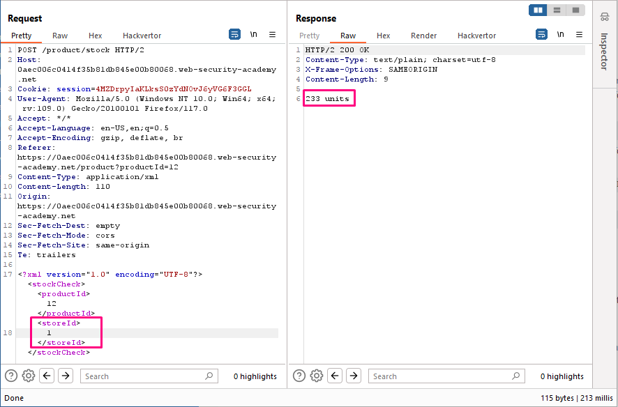
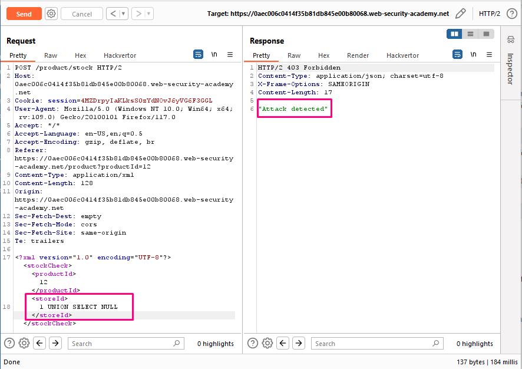
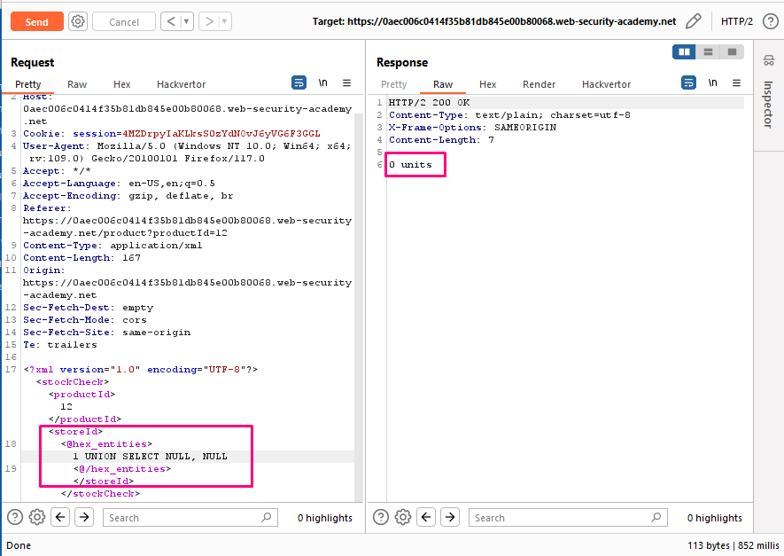

## SQL injection with filter bypass via XML encoding

**Title:** SQL injection with filter bypass via XML encoding. [Go](https://portswigger.net/web-security/sql-injection/lab-sql-injection-with-filter-bypass-via-xml-encoding)

**Description:**  This lab contains a SQL injection vulnerability in its stock check feature. The results from the query are returned in the application's response, so you can use a UNION attack to retrieve data from other tables. The database contains a `users` table, which contains the usernames and passwords of registered users. To solve the lab, perform a SQL injection attack to retrieve the admin user's credentials, then log in to their account. 

## Preface
 In the previous labs, you used the query string to inject your malicious SQL payload. However, you can perform SQL injection attacks using any controllable input that is processed as a SQL query by the application. For example, some websites take input in JSON or XML format and use this to query the database.

These different formats may provide different ways for you to obfuscate attacks that are otherwise blocked due to WAFs and other defense mechanisms. Weak implementations often look for common SQL injection keywords within the request, so you may be able to bypass these filters by encoding or escaping characters in the prohibited keywords. For example, the following XML-based SQL injection uses an XML escape sequence to encode the `S` character in `SELECT`:

``` XML
<stockCheck>
    <productId>123</productId>
    <storeId>999 &#x53;ELECT * FROM information_schema.tables</storeId>
</stockCheck>
```
This will be decoded server-side before being passed to the SQL interpreter.  

## Methodology

### Finding the vulnerable parameter
Initially, our foremost objective is to identify a potential vulnerability within the application's parameters that allows for the execution of SQL queries. In the context of this shopping application, we are particularly interested in the stock check functionality  , where the backend logic is designed to query the submitted data.

### My thought

Observe that the stock check feature sends the productId and storeId to the application in XML format. Send the `POST /product/stock` request to Burp Repeater.



After invoking `1 UNION SELECT NULL` "Attack detected" shows in http response that means this web application is using some kind of web application firewall. 



As we're injecting into XML, try obfuscating our payload using XML entities. One way to do this is using the Hackvertor extension. Just highlight our input, right-click, then select Extensions > Hackvertor > Encode > hex_entities. At the same time we determined our database table has only one column.



As we can only return one column, we need to concatenate the returned usernames and passwords, for example: `<storeId><@hex_entities>1 UNION SELECT username || '~' || password FROM users<@/hex_entities></storeId>`


