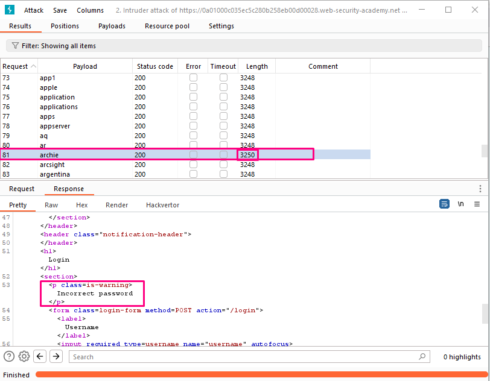
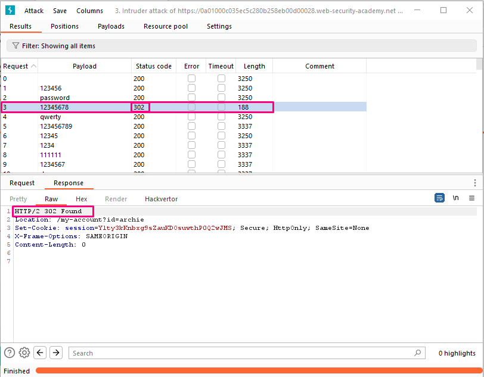

## Username enumeration via different responses

**Title:** Username enumeration via different responses. [Go](https://portswigger.net/web-security/authentication/password-based/lab-username-enumeration-via-different-responses)

**Description:** 
This lab is vulnerable to username enumeration and password brute-force attacks. It has an account with a predictable username and password, which can be found in the following wordlists:

- Candidate usernames
- Candidate passwords

To solve the lab, enumerate a valid username, brute-force this user's password, then access their account page.

## Preface

While attempting to brute-force a login page, we should pay particular attention to any differences in:

**Status codes**: During a brute-force attack, the returned HTTP status code is likely to be the same for the vast majority of guesses because most of them will be wrong. If a guess returns a different status code, this is a strong indication that the username was correct. It is best practice for websites to always return the same status code regardless of the outcome, but this practice is not always followed.

**Error messages**: Sometimes the returned error message is different depending on whether both the username AND password are incorrect or only the password was incorrect. It is best practice for websites to use identical, generic messages in both cases, but small typing errors sometimes creep in. Just one character out of place makes the two messages distinct, even in cases where the character is not visible on the rendered page.

**Response times**: If most of the requests were handled with a similar response time, any that deviate from this suggest that something different was happening behind the scenes. This is another indication that the guessed username might be correct. For example, a website might only check whether the password is correct if the username is valid. This extra step might cause a slight increase in the response time. This may be subtle, but an attacker can make this delay more obvious by entering an excessively long password that the website takes noticeably longer to handle.

## Methodology

### Finding the vulnerable parameter

While solving this lab we are interested in `POST /login` endpoint.

### My thought

With Burp running, investigate the login page and submit an invalid username and password. In Burp, go to Proxy > HTTP history and find the `POST /login` request. Highlight the value of the username parameter in the request and send it to Burp Intruder.

In Burp Intruder, go to the Positions tab. Notice that the username parameter is automatically set as a payload position. This position is indicated by two § symbols, for example: `username=§invalid-username§`. Leave the password as any static value for now. Make sure that the Sniper attack type is selected. On the Payloads tab, make sure that the Simple list payload type is selected. Under Payload settings, paste the list of candidate usernames given in lab description. Finally, click Start attack. The attack will start in a new window. When the attack is finished, on the Results tab, examine the Length column. You can click on the column header to sort the results. Notice that one of the entries is longer than the others. Compare the response to this payload with the other responses. Notice that other responses contain the message `Invalid username`, but this response says `Incorrect password`. Make a note of the username in the Payload column.



Close the attack and go back to the Positions tab. Click Clear, then we change the username parameter to the username we just identified. Add a payload position to the password parameter. The result should look something like this: `username=archie&password=§invalid-password§`.
On the Payloads tab, clear the list of usernames and replace it with the list of candidate passwords. Click Start attack. When the attack is finished, look at the Status column. Notice that each request received a response with a 200 status code except for one, which got a 302 response. This suggests that the login attempt was successful - make a note of the password in the Payload column.



**Insight:** 

To enhance the security and user experience of our web application, it's important to provide clear and user-friendly error messages without revealing too much information. You can modify the error message to be more generic, like "Invalid Username or Password" to avoid leaking information about the correctness of the username. Here's an example of how you can implement this in a web application:
``` PHP
<!DOCTYPE html>
<html>
<head>
    <title>Login</title>
</head>
<body>
    <h1>Login</h1>
    <form action="/login" method="post">
        <label for="username">Username:</label>
        <input type="text" id="username" name="username" required><br><br>

        <label for="password">Password:</label>
        <input type="password" id="password" name="password" required><br><br>

        <button type="submit">Login</button>
    </form>
 
    <?php
    // PHP code for handling login logic
    if ($_SERVER["REQUEST_METHOD"] == "POST") {
        $username = $_POST["username"];
        $password = $_POST["password"];

        // Check the username and password against your database or authentication system
        if (isValidUser($username, $password)) {
            // Successful login. Redirect to the user's dashboard or a secure page.
            header("Location: dashboard.php");
            exit();
        } else {
            // Invalid username or password
            echo '<p style="color: red;">Invalid Username or Password</p>';
        }
    }

    // Function to validate user credentials (replace with your own logic)
    function isValidUser($username, $password) {
        /* Replace this with your authentication logic (e.g., database query). Return true if the credentials are valid, otherwise false.
          Be sure to perform secure password hashing and validation. */
        return false; // Change this to your validation logic
    }
    ?>
</body>
</html>
```

Remember to replace the `isValidUser` function with your actual authentication logic, including secure password hashing and validation. This approach helps improve security by not disclosing whether the username exists in the system, making it harder for potential attackers to enumerate valid usernames.
