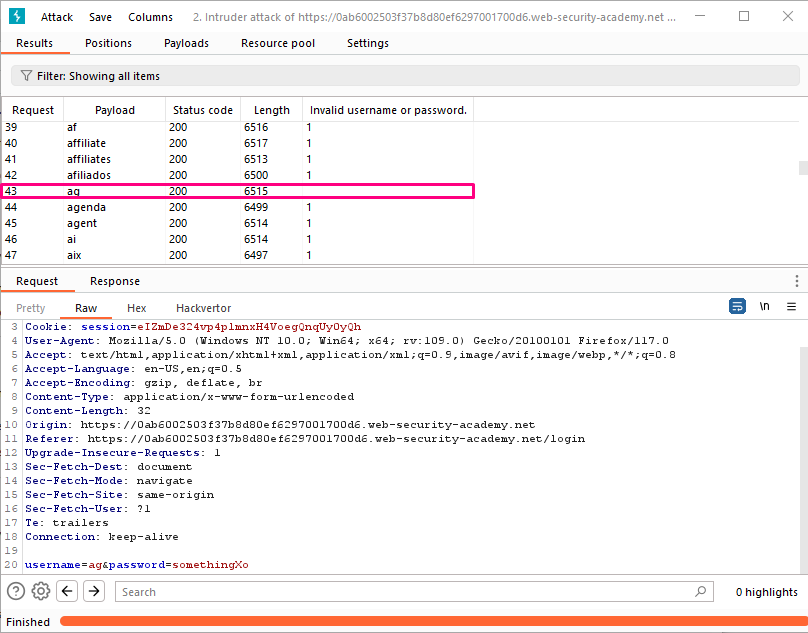

## Username enumeration via subtly different responses

**Title:** Username enumeration via subtly different responses. [Go](https://portswigger.net/web-security/authentication/password-based/lab-username-enumeration-via-subtly-different-responses)

**Description:** 
This lab is subtly vulnerable to username enumeration and password brute-force attacks. It has an account with a predictable username and password, which can be found in the following wordlists:

- Candidate usernames
- Candidate passwords

To solve the lab, enumerate a valid username, brute-force this user's password, then access their account page.

## Preface

While attempting to brute-force a login page, we should pay particular attention to any differences in:

**Status codes**: During a brute-force attack, the returned HTTP status code is likely to be the same for the vast majority of guesses because most of them will be wrong. If a guess returns a different status code, this is a strong indication that the username was correct. It is best practice for websites to always return the same status code regardless of the outcome, but this practice is not always followed.

**Error messages**: Sometimes the returned error message is different depending on whether both the username AND password are incorrect or only the password was incorrect. It is best practice for websites to use identical, generic messages in both cases, but small typing errors sometimes creep in. Just one character out of place makes the two messages distinct, even in cases where the character is not visible on the rendered page.

**Response times**: If most of the requests were handled with a similar response time, any that deviate from this suggest that something different was happening behind the scenes. This is another indication that the guessed username might be correct. For example, a website might only check whether the password is correct if the username is valid. This extra step might cause a slight increase in the response time. This may be subtle, but an attacker can make this delay more obvious by entering an excessively long password that the website takes noticeably longer to handle.

## Methodology

### Finding the vulnerable parameter

While solving this lab we are interested in `POST /login` endpoint.

### My thought

With Burp running, submit an invalid username and password. Highlight the username parameter in the `POST /login` request and send it to Burp Intruder. On the Payloads tab, notice that the username parameter is automatically marked as a payload position. Make sure that the Simple list payload type is selected and add the list of candidate usernames.
On the Settings tab, under Grep - Match, click Add. In the dialog that appears, scroll down through the response until you find the error message `Invalid username or password.`. Use the mouse to highlight the text content of the message. The other settings will be automatically adjusted. Click OK and then start the attack.

When the attack is finished, notice that there is an additional column containing the error message you extracted. Sort the results using this column to notice that one of them is subtly different. Look closer at this response and notice that it contains a typo in the error message - instead of a full stop/period, there is a trailing space. Make a note of this username.

Close the attack and go back to the Positions tab. Insert the username you just identified and add a payload position to the password parameter: `username=ag&password=§invalid-password§`
On the Payloads tab, clear the list of usernames and replace it with the list of passwords. Start the attack. When the attack is finished, notice that one of the requests received a 302 response. Make a note of this password.

Log in using the username and password that you identified and access the user account page to solve the lab.

**Insight:**
In web security, it's essential to consistently provide the same vague error message, like `Incorrect username or password` whether someone enters the wrong username, password, or both. Small errors can accidentally reveal which part is incorrect, potentially aiding attackers. To ensure both security and user-friendliness, maintaining uniform error messages is crucial.
