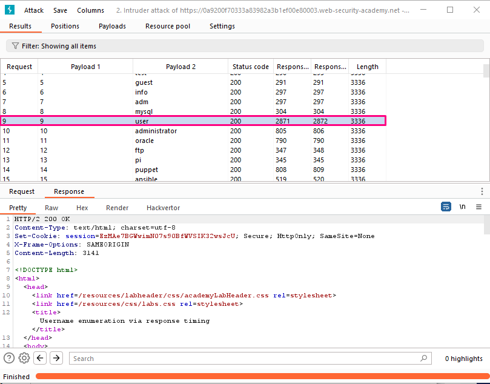
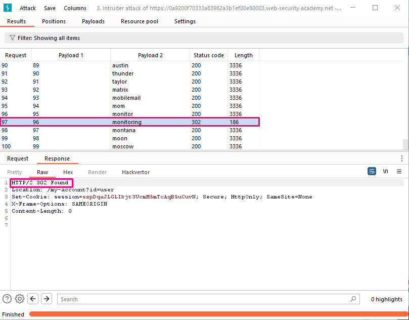

## Username enumeration via response timing

**Title:** Username enumeration via response timing. [Go](https://portswigger.net/web-security/authentication/password-based/lab-username-enumeration-via-response-timing)

**Description:** 
This lab is vulnerable to username enumeration using its response times. To solve the lab, enumerate a valid username, brute-force this user's password, then access their account page.

Your credentials: `wiener:peter`

- Candidate usernames
- Candidate passwords

## Preface

While attempting to brute-force a login page, we should pay particular attention to any differences in:

**Status codes**: During a brute-force attack, the returned HTTP status code is likely to be the same for the vast majority of guesses because most of them will be wrong. If a guess returns a different status code, this is a strong indication that the username was correct. It is best practice for websites to always return the same status code regardless of the outcome, but this practice is not always followed.

**Error messages**: Sometimes the returned error message is different depending on whether both the username AND password are incorrect or only the password was incorrect. It is best practice for websites to use identical, generic messages in both cases, but small typing errors sometimes creep in. Just one character out of place makes the two messages distinct, even in cases where the character is not visible on the rendered page.

**Response times**: If most of the requests were handled with a similar response time, any that deviate from this suggest that something different was happening behind the scenes. This is another indication that the guessed username might be correct. For example, a website might only check whether the password is correct if the username is valid. This extra step might cause a slight increase in the response time. This may be subtle, but an attacker can make this delay more obvious by entering an excessively long password that the website takes noticeably longer to handle.

## Methodology

### Finding the vulnerable parameter

While solving this lab we are interested in `POST /login` endpoint.

### My thought

With Burp running, submit an invalid username and password, then send the `POST /login` request to Burp Repeater. Experiment with different usernames and passwords. Notice that your IP will be blocked if you make too many invalid login attempts.

Identify that the `X-Forwarded-For` header is supported, which allows you to spoof your IP address and bypass the IP-based brute-force protection.
Continue experimenting with usernames and passwords. Pay particular attention to the response times. Notice that when the username is invalid, the response time is roughly the same. However, when you enter a valid username (our own), the response time is increased depending on the length of the password we entered.

Send this request to Burp Intruder and select the attack type to Pitchfork. Add the `X-Forwarded-For` header. Add payload positions for the `X-Forwarded-For` header and the username parameter. Set the password to a very long string of characters (about 100 characters should do it). On the Payloads tab, select payload set 1. Select the Numbers payload type. Enter the range 1 - 100 and set the step to 1. Set the max fraction digits to 0. This will be used to spoof our IP.

Select payload set 2 and add the list of usernames. Start the attack.
When the attack finishes, at the top of the dialog, click Columns and select the Response received and Response completed options. These two columns are now displayed in the results table.

Notice that one of the response times was significantly longer than the others. Repeat this request a few times to make sure it consistently takes longer, then make a note of this username.

Create a new Burp Intruder attack for the same request. Add the `X-Forwarded-For` header again and add a payload position to it. Insert the username that you just identified and add a payload position to the password parameter.

On the Payloads tab, add the list of numbers in payload set 1 and add the list of passwords to payload set 2. Start the attack. When the attack is finished, find the response with a 302 status. Make a note of this password.

Log in using the username and password that you identified and access the user account page to solve the lab. 

**Insight:**
In the context of web application security, it's important for an application to be fast enough to efficiently handle each user request. However, it's also crucial to be cautious about response times because unusually slow or inconsistent responses can potentially provide attackers with valuable information. Maintaining a balance between speed and security is essential to ensure both user satisfaction and protection against potential threats.
