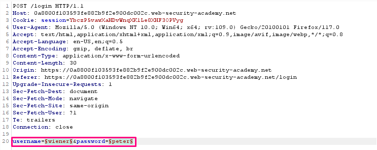
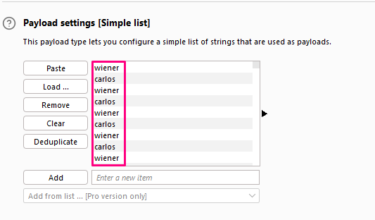
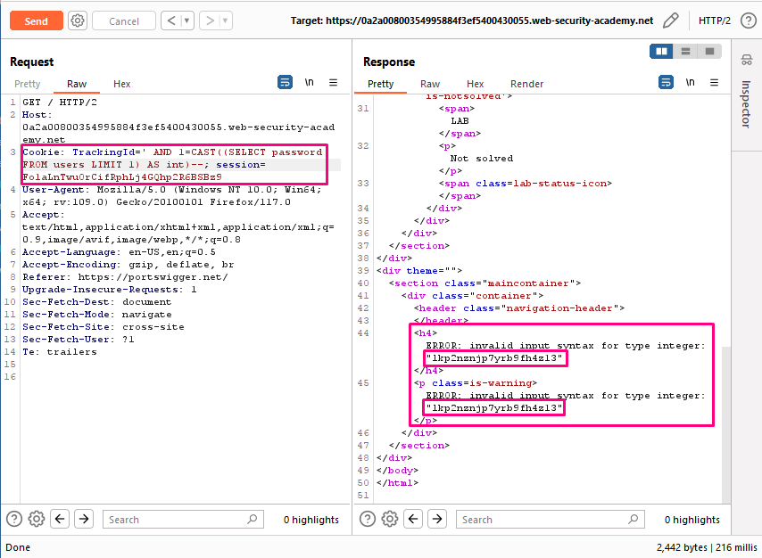

## Broken brute-force protection, IP block

**Title:** Broken brute-force protection, IP block. [Go](https://portswigger.net/web-security/authentication/password-based/lab-broken-bruteforce-protection-ip-block)

**Description:**

This lab is vulnerable due to a logic flaw in its password brute-force protection. To solve the lab, brute-force the victim's password, then log in and access their account page.

Your credentials: wiener:peter
Victim's username: carlos

- Candidate passwords

## Preface

It is highly likely that a brute-force attack will involve many failed guesses before the attacker successfully compromises an account. Logically, brute-force protection revolves around trying to make it as tricky as possible to automate the process and slow down the rate at which an attacker can attempt logins. The two most common ways of preventing brute-force attacks are:

- Locking the account that the remote user is trying to access if they make too many failed login attempts.

- Blocking the remote user's IP address if they make too many login attempts in quick succession.

Both approaches offer varying degrees of protection, but neither is invulnerable, especially if implemented using flawed logic.

For example, you might sometimes find that your IP is blocked if you fail to log in too many times. In some implementations, the counter for the number of failed attempts resets if the IP owner logs in successfully. This means an attacker would simply have to log in to their own account every few attempts to prevent this limit from ever being reached.

In this case, merely including your own login credentials at regular intervals throughout the wordlist is enough to render this defense virtually useless.

## Methodology

### Finding the vulnerable parameter

While solving this lab we are interested in `POST /login` endpoint.

### My thought

With Burp running, investigate the login page. Observe that our IP is temporarily blocked if we submit 3 incorrect logins in a row. However, notice that we can reset the counter for the number of failed login attempts by logging in to our own account before this limit is reached. Enter an invalid username and password, then send the `POST /login` request to Burp Intruder. Create a pitchfork attack with payload positions in both the username and password parameters. On the Resource pool tab, add the attack to a resource pool with Maximum concurrent requests set to 1. By only sending one request at a time, we can ensure that our login attempts are sent to the server in the correct order. On the Payloads tab, select payload set 1. Add a list of payloads that alternates between your username and `carlos`. Make sure that our username is first and that `carlos` is repeated at least 100 times. Edit the list of candidate passwords and add our own password before each one. Make sure that our password is aligned with our username in the other list. Add this list to payload set 2 and start the attack.

When the attack finishes, filter the results to hide responses with a 200 status code. Sort the remaining results by username. There should only be a single 302 response for requests with the username `carlos`. Make a note of the password from the Payload 2 column.

Log in to `carlos`'s account using the password that we identified and access his account page to solve the lab.

**Insight:**

Talking to application security a application should be robust enough to mitigate brute force attack. Developer should implement all possible security hardening method to mitigate all brute force bypass technique.
