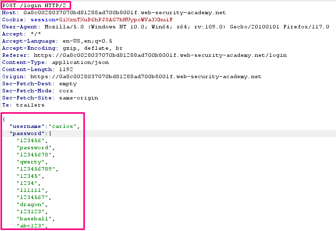
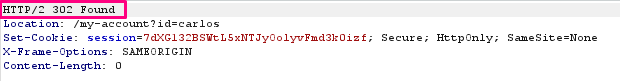

## Broken brute-force protection, multiple credentials per request

**Title:** Broken brute-force protection, multiple credentials per request. [Go](https://portswigger.net/web-security/authentication/password-based/lab-broken-brute-force-protection-multiple-credentials-per-request)

**Description:**  This lab is vulnerable due to a logic flaw in its brute-force protection. To solve the lab, brute-force Carlos's password, then access his account page.

- Victim's username: `carlos`
- Candidate passwords

## Preface

Another way websites try to prevent brute-force attacks is through user rate limiting. In this case, making too many login requests within a short period of time causes your IP address to be blocked. Typically, the IP can only be unblocked in one of the following ways:

-   Automatically after a certain period of time has elapsed
-   Manually by an administrator
-   Manually by the user after successfully completing a CAPTCHA

User rate limiting is sometimes preferred to account locking due to being less prone to username enumeration and denial of service attacks. However, it is still not completely secure. As we saw an example of in an earlier lab, there are several ways an attacker can manipulate their apparent IP in order to bypass the block.

As the limit is based on the rate of HTTP requests sent from the user's IP address, it is sometimes also possible to bypass this defense if you can work out how to guess multiple passwords with a single request.

## Methodology

### Finding the vulnerable parameter

While solving this lab we are interested in `POST /login` endpoint.

### My thought
With Burp running, investigate the login page. Notice that the `POST /login` request submits the login credentials in JSON format. Send this request to Burp Repeater.

In Burp Repeater, replace the single string value of the password with an array of strings containing all of the candidate passwords. For example:

Send the request. This will return a 302 response. Right-click on this request and select Show response in browser. Copy the URL and load it in the browser. The page loads and you are logged in as `carlos`. Click My account to access Carlos's account page and solve the lab.

**Insight:**
Talking to application security a application should be robust enough to mitigate brute force attack. Developer should implement all possible security hardening method to mitigate all brute force bypass technique.
