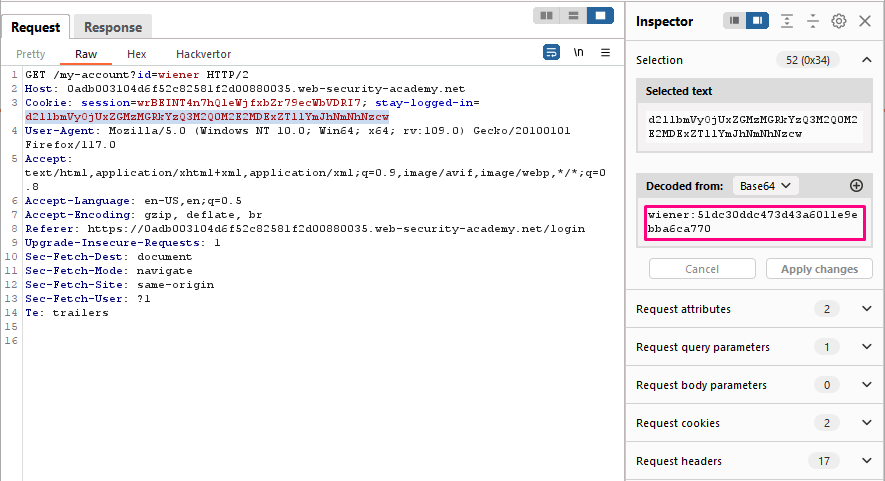
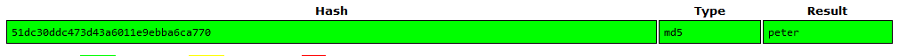
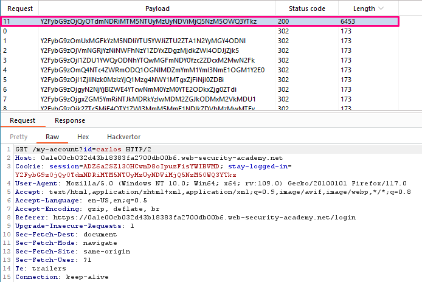
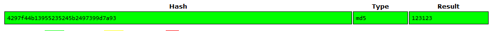

## Brute-forcing a stay-logged-in cookie

**Title:** Brute-forcing a stay-logged-in cookie. [Go](https://portswigger.net/web-security/authentication/other-mechanisms/lab-brute-forcing-a-stay-logged-in-cookie)

**Description:** 

This lab allows users to stay logged in even after they close their browser session. The cookie used to provide this functionality is vulnerable to brute-forcing.

To solve the lab, brute-force Carlos's cookie to gain access to his "My account" page.

- Your credentials: `wiener:peter`
- Victim's username: `carlos`
- Candidate passwords

## Preface

A common feature is the option to stay logged in even after closing a browser session. This is usually a simple checkbox labeled something like "Remember me" or "Keep me logged in".

This functionality is often implemented by generating a "remember me" token of some kind, which is then stored in a persistent cookie. As possessing this cookie effectively allows you to bypass the entire login process, it is best practice for this cookie to be impractical to guess. However, some websites generate this cookie based on a predictable concatenation of static values, such as the username and a timestamp. Some even use the password as part of the cookie. This approach is particularly dangerous if an attacker is able to create their own account because they can study their own cookie and potentially deduce how it is generated. Once they work out the formula, they can try to brute-force other users' cookies to gain access to their accounts.

Some websites assume that if the cookie is encrypted in some way it will not be guessable even if it does use static values. While this may be true if done correctly, naively "encrypting" the cookie using a simple two-way encoding like Base64 offers no protection whatsoever. Even using proper encryption with a one-way hash function is not completely bulletproof. If the attacker is able to easily identify the hashing algorithm, and no salt is used, they can potentially brute-force the cookie by simply hashing their wordlists. This method can be used to bypass login attempt limits if a similar limit isn't applied to cookie guesses. 

Even if the attacker is not able to create their own account, they may still be able to exploit this vulnerability. Using the usual techniques, such as XSS, an attacker could steal another user's "remember me" cookie and deduce how the cookie is constructed from that. If the website was built using an open-source framework, the key details of the cookie construction may even be publicly documented.

In some rare cases, it may be possible to obtain a user's actual password in cleartext from a cookie, even if it is hashed. Hashed versions of well-known password lists are available online, so if the user's password appears in one of these lists, decrypting the hash can occasionally be as trivial as just pasting the hash into a search engine. This demonstrates the importance of salt in effective encryption. 

## Methodology

### Finding the vulnerable parameter

While solving this lab we are interested in `POST /login` endpoint.

### My thought

With Burp running, we logged in to our own account with the stay logged in option selected. We noticed that this sets a `stay-logged-in` cookie.  After examining this cookie in the Inspector panel and we noticed that it is Base64-encoded. Its decoded value is `wiener:51dc30ddc473d43a6011e9ebba6ca770`. 

We used [Crackstation](https://crackstation.net/) to identify the hash type and found that it is md5 hashed of wiener's password. 

We now know that the cookie is constructed as follows: `base64(username+':'+md5HashOfPassword)`. Then we logged out from our account. In the most recent `GET /my-account?id=wiener`, we highlighted the `stay-logged-in` cookie parameter and send the request to Burp Intruder and changed the id parameter to `carlos`. In Burp Intruder, noticed that the `stay-logged-in` cookie has been automatically added as a payload position. In Payload processing section, we added the following rules in order. These rules will be applied sequentially to each payload before the request is submitted.

- Hash: `MD5`
- Add prefix: `carlos:`
- Encode: `Base64-encode`

We determined the correct cookie from different length among all these values. We again then cracked md5 portion using [Crackstation](https://crackstation.net/). 

And we cracked the password.
