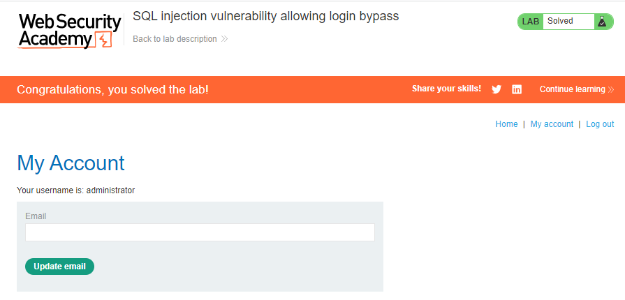

## SQL injection vulnerability allowing login bypass
**Title:** SQL injection vulnerability allowing login bypass. [Go](https://portswigger.net/web-security/sql-injection/lab-login-bypass)

**Description:** This lab contains a SQL injection vulnerability in the login function. To solve the lab, perform a SQL injection attack that logs in to the application as the  `administrator`  user.

## Preface
Subverting application logic, where we can change a query to interfere with the application's logic. Consider an application that lets users log in with a username and password. If a user submits the username wiener and the password `bluecheese`, the application checks the credentials by performing the following SQL query:
```sql
SELECT * FROM users WHERE username = 'wiener' AND password = 'bluecheese'
```
If the query returns the details of a user, then the login is successful. Otherwise, it is rejected.

Here, an attacker can log in as any user without a password simply by using the SQL comment sequence `--` to remove the password check from the `WHERE` clause of the query. For example, submitting the username `administrator'--` and a blank password results in the following query:
```sql
SELECT * FROM users WHERE username = 'administrator'--' AND password = ''
```
This query returns the user whose username is administrator and successfully logs the attacker in as that user.

## Methodology
### Finding the vulnerable parameter
First thing first, we have to first find a vulnerable parameter where SQL query can be possible. This web app has login functionality. Where the possible query will be something like this:
```sql
SELECT * FROM users WHERE username = '<username>' AND password = '<password>'
```
### My thought
Let's think about how can we skip the password check... If we commented out the password key then there is  possibility...

### Payload
As from the lab description we know __administrator__ user exists in database. By submitting `administrator'--` in username parameter in the login functionality then  the query will be something like this:
```sql
SELECT * FROM users WHERE username = 'administrator'--' AND password = '<password>'
```
Here, after  `--`  the rest of the query will be commented out by this password check will be bypassed.



**Understanding the logic:** As the application doesn't implement any defenses against SQL injection attacks, so by using comment sequence we can easily skip the password check functionality.

 **Note:**
Notice that in the process of solving the lab we didn’t confirm where the vulnerability exists or not. As from the lab description we know that the `username` parameter is vulnerable to SQLi. So, We didn't do any confirmation test or something like that. But in a real world scenario you have to first confirm the vulnerability then go for further exploitation.
