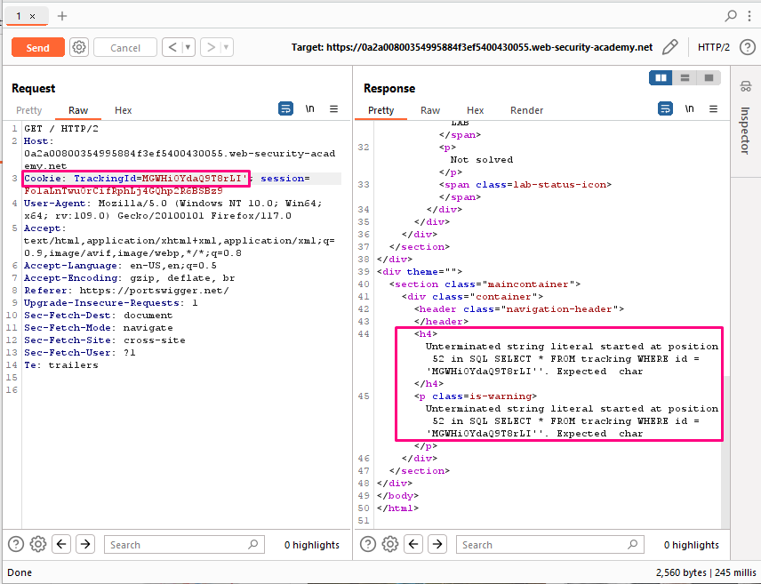
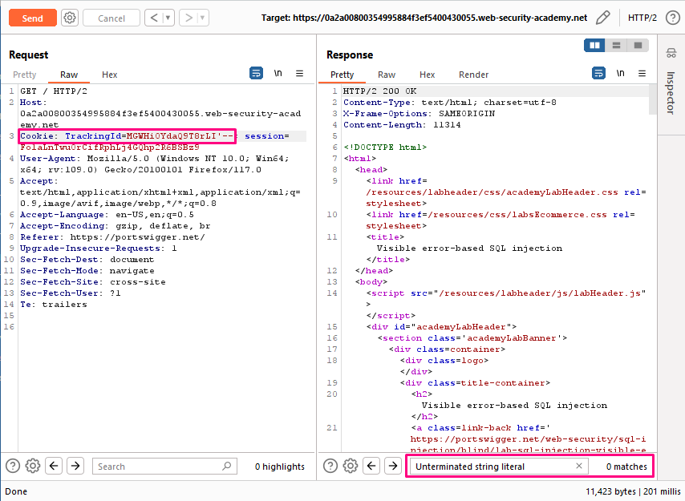
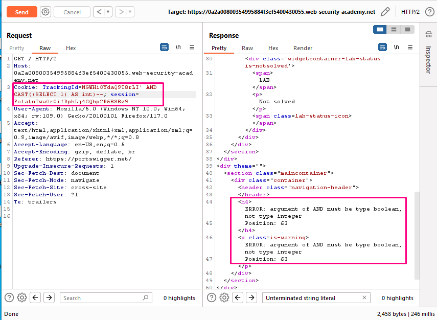
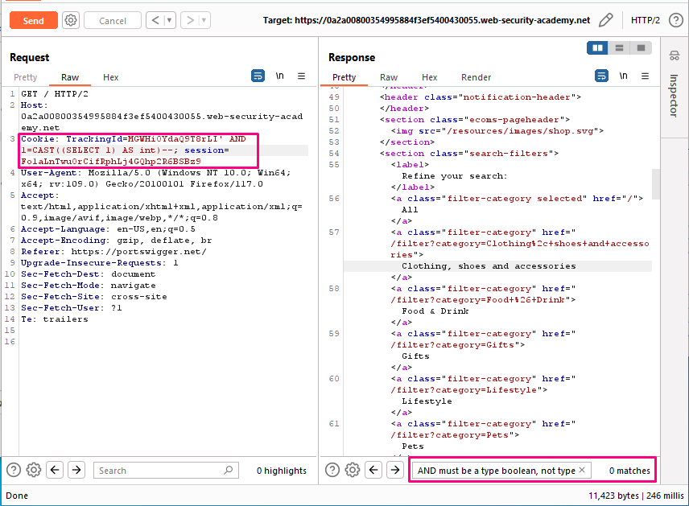
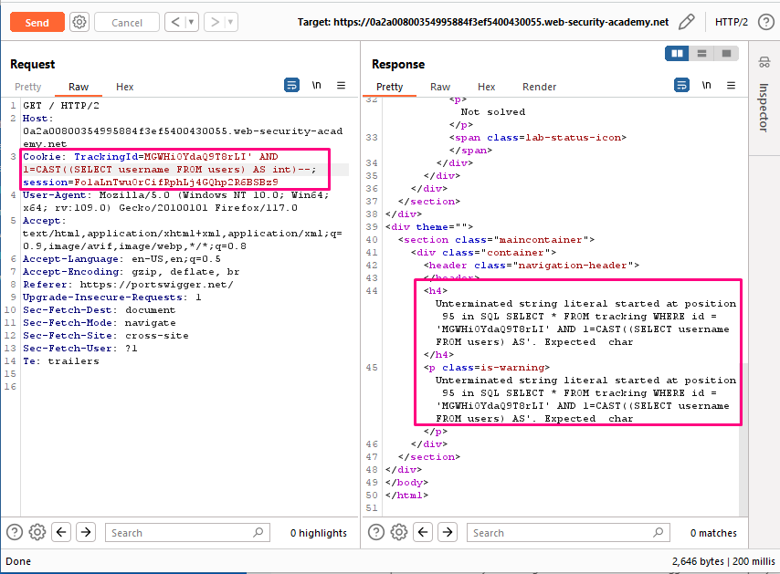
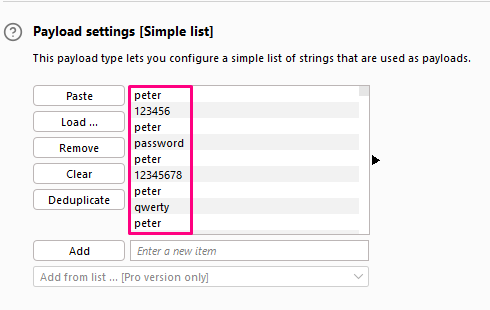

## Visible error-based SQL injection

**Title:** Visible error-based SQL injection. [GO](https://portswigger.net/web-security/sql-injection/blind/lab-sql-injection-visible-error-based)

**Description:** This lab contains a SQL injection vulnerability. The application uses a tracking cookie for analytics, and performs a SQL query containing the value of the submitted cookie. The results of the SQL query are not returned. The database contains a different table called `users`, with columns called `username` and `password`. To solve the lab, find a way to leak the password for the `administrator` user, then log in to their account.

## Preface

Misconfiguration of the database sometimes results in verbose error messages. These can provide information that may be useful to an attacker. For example, consider the following error message, which occurs after injecting a single quote into an id parameter:
`Unterminated string literal started at position 52 in SQL SELECT * FROM tracking WHERE id = '''. Expected char`
This shows the full query that the application constructed using our input. We can see that in this case, we're injecting into a single-quoted string inside a `WHERE` statement. This makes it easier to construct a valid query containing a malicious payload. Commenting out the rest of the query would prevent the superfluous single-quote from breaking the syntax. Occasionally, you may be able to induce the application to generate an error message that contains some of the data that is returned by the query. This effectively turns an otherwise blind SQL injection vulnerability into a visible one. You can use the `CAST()` function to achieve this. It enables you to convert one data type to another. For example, imagine a query containing the following statement: `CAST((SELECT example_column FROM example_table) AS int)`
Often, the data that you're trying to read is a string. Attempting to convert this to an incompatible data type, such as an `int`, may cause an error similar to the following: `ERROR: invalid input syntax for type integer: "Example data"`
This type of query may also be useful if a character limit prevents you from triggering conditional responses.

## Methodology

### Finding the vulnerable parameter
Initially, our foremost objective is to identify a potential vulnerability within the application's parameters that allows for the execution of SQL queries. In the context of this shopping application, we are particularly interested in the `TrackingId` cookie parameter , where the backend logic is designed to query the submitted data.

### My thought

Appending a single quote to the value of our `TrackingId` cookie and send the request. `TrackingId=MGWHiOYdaQ9T8rLI'`. In the response, notice the verbose error message. This discloses the full SQL query, including the value of our cookie. It also explains that we have an unclosed string literal. Observe that our injection appears inside a single-quoted string. In the request, add comment characters to comment out the rest of the query, including the extra single-quote character that's causing the error: `TrackingId=MGWHiOYdaQ9T8rLI'--`. Send the request. Confirm that you no longer receive an error. This suggests that the query is now syntactically valid.

Adapt the query to include a generic SELECT subquery and cast the returned value to an `int` data type: `TrackingId=MGWHiOYdaQ9T8rLI' AND CAST((SELECT 1) AS int)--`. Send the request. Observe that now we get a different error saying that an `AND must be a type boolean, not type integer`.

Modify the condition accordingly. For example, we can simply add a comparison operator (=) as follows: `TrackingId=MGWHiOYdaQ9T8rLI' AND 1=CAST((SELECT 1) AS int)--`. Send the request. Confirm that you no longer receive an error. This suggests that this is a valid query again.

Adapt our generic `SELECT` statement so that it retrieves usernames from the database: `TrackingId=MGWHiOYdaQ9T8rLI' AND 1=CAST((SELECT username FROM users) AS int)--`. Observe that you receive the initial error message again. Notice that your query now appears to be truncated due to a character limit. As a result, the comment characters you added to fix up the query aren't included.

Delete the original value of the `TrackingId` cookie to free up some additional characters. Resend the request. `TrackingId=' AND 1=CAST((SELECT username FROM users) AS int)--`. Notice that you receive a new error message, which appears to be generated by the database. This suggests that the query was run properly, but you're still getting an error because it unexpectedly returned more than one row. Modify the query to return only one row: `TrackingId=' AND 1=CAST((SELECT username FROM users LIMIT 1) AS int)--`. Send the request. Observe that the error message now leaks the first username from the users table: `ERROR: invalid input syntax for type integer: "administrator"`

Now that you know that the administrator is the first user in the table, modify the query once again to leak their password: `TrackingId=' AND 1=CAST((SELECT password FROM users LIMIT 1) AS int)--`.

**Summary:**
1. Confirmation of vulnerability with `TrackingId=MGWHiOYdaQ9T8rLI'`, `TrackingId=MGWHiOYdaQ9T8rLI'--`.
 
2. Confirmation of `administrator` user with `TrackingId=' AND 1=CAST((SELECT username FROM users LIMIT 1) AS int)--`.

3.  Password enumeration with `TrackingId=' AND 1=CAST((SELECT password FROM users LIMIT 1) AS int)--`.
