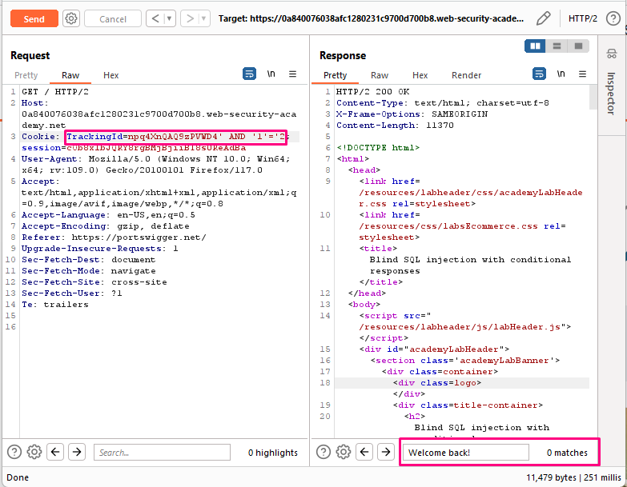
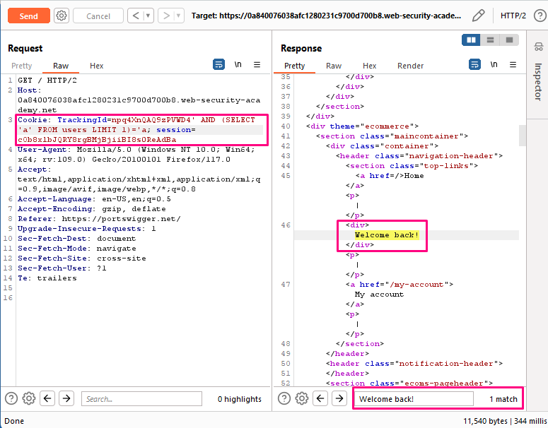
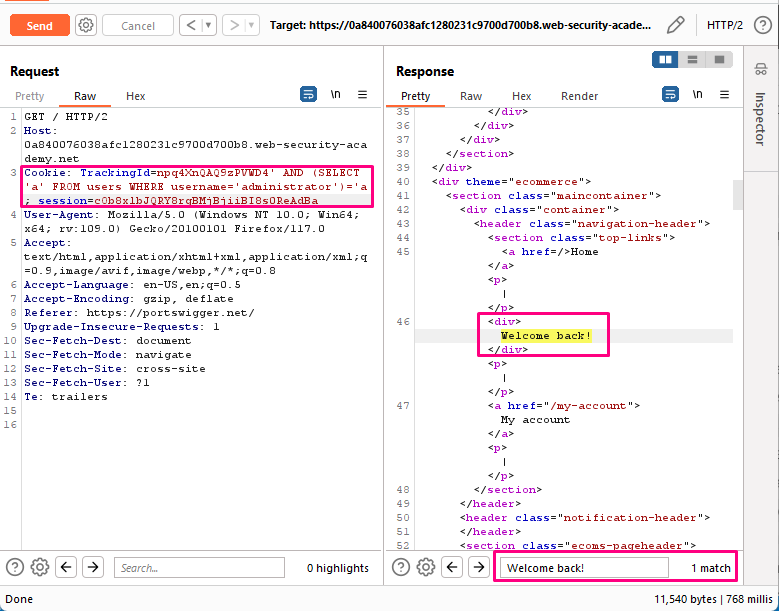
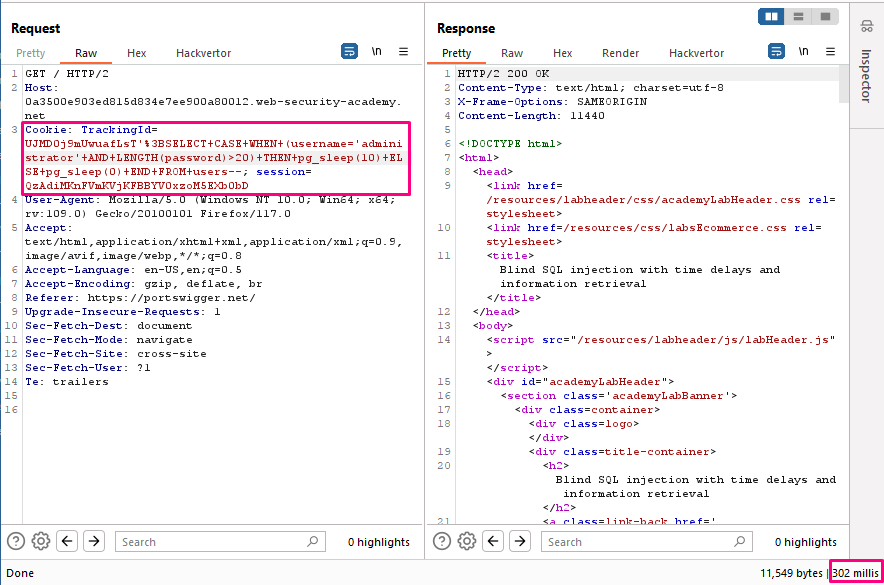
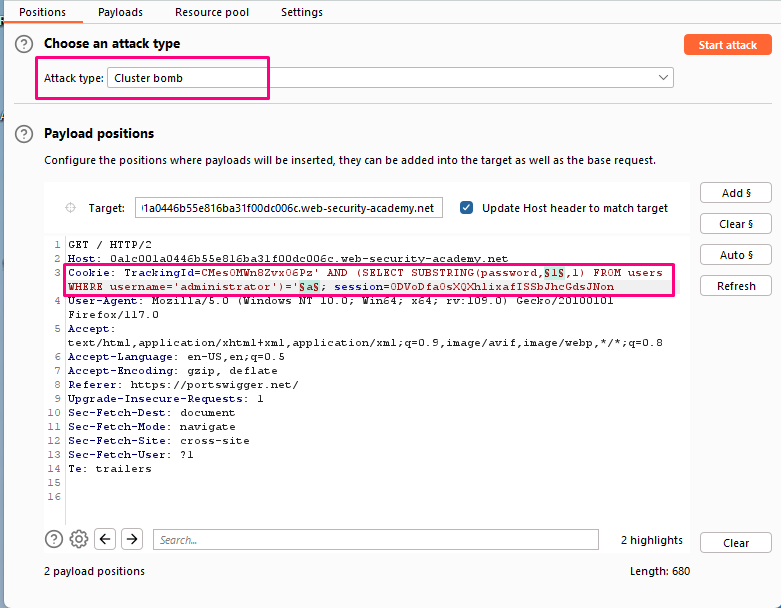
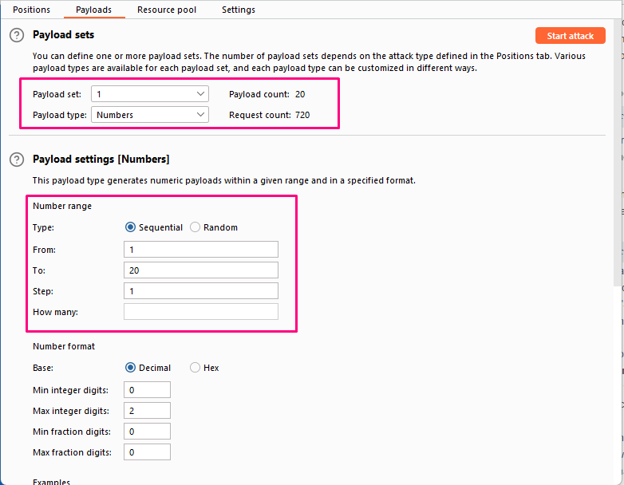
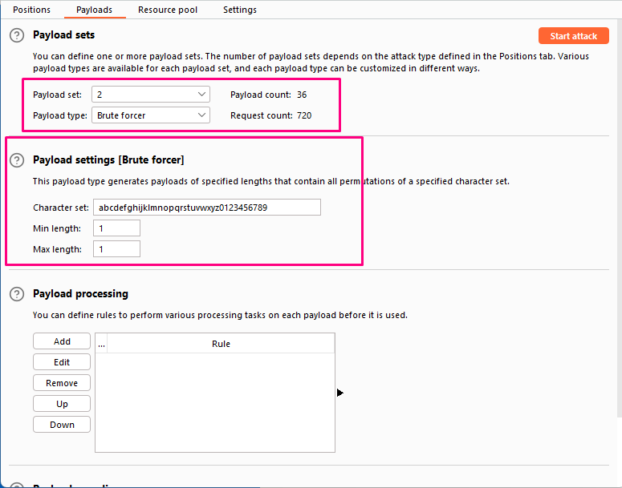
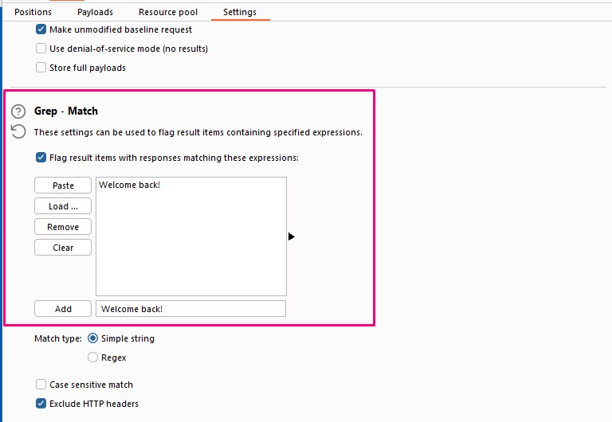
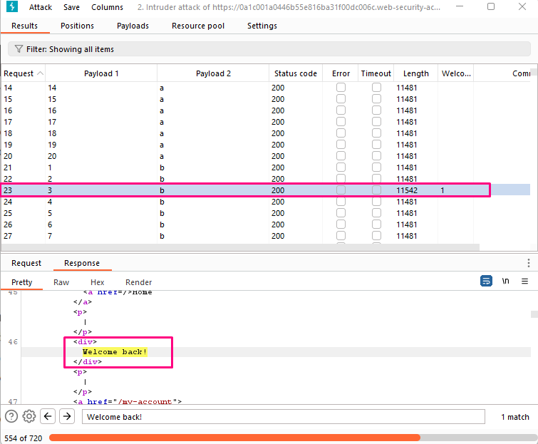

## Blind SQL injection with conditional responses

**Title:** Blind SQL injection with conditional responses. [Go](https://portswigger.net/web-security/sql-injection/blind/lab-conditional-responses)

**Description:** This lab contains a blind SQL injection vulnerability. The application uses a tracking cookie for analytics, and performs a SQL query containing the value of the submitted cookie. The results of the SQL query are not returned, and no error messages are displayed. But the application includes a `Welcome back` message in the page if the query returns any rows. The database contains a different table called `users`, with columns called `username` and `password`. You need to exploit the blind SQL injection vulnerability to find out the password of the administrator user.
To solve the lab, log in as the `administrator` user.

## Preface

Blind SQL injection occurs when an application is vulnerable to SQL injection, but its HTTP responses do not contain the results of the relevant SQL query or the details of any database errors. Many techniques such as UNION attacks are not effective with blind SQL injection vulnerabilities. This is because they rely on being able to see the results of the injected query within the application's responses.

Consider an application that uses tracking cookies to gather analytics about usage. Requests to the application include a cookie header like this:
`Cookie: TrackingId=u5YD3PapBcR4lN3e7Tj4`
When a request containing a `TrackingId` cookie is processed, the application uses a SQL query to determine whether this is a known user:
`SELECT TrackingId FROM TrackedUsers WHERE TrackingId = 'u5YD3PapBcR4lN3e7Tj4'`
This query is vulnerable to SQL injection, but the results from the query are not returned to the user. However, the application does behave differently depending on whether the query returns any data. If you submit a recognized `TrackingId`, the query returns data and you receive a `Welcome back` message in the response.

This behavior is enough to be able to exploit the blind SQL injection vulnerability. You can retrieve information by triggering different responses conditionally, depending on an injected condition.

To understand how this exploit works, suppose that two requests are sent containing the following `TrackingId` cookie values in turn:
`…xyz' AND '1'='1` & `…xyz' AND '1'='2`

The first of these values causes the query to return results, because the injected AND `'1'='1` condition is true. As a result, the `Welcome back` message is displayed.
The second value causes the query to not return any results, because the injected condition is false. The `Welcome back` message is not displayed. This allows us to determine the answer to any single injected condition, and extract data one piece at a time.

For example, suppose there is a table called `Users` with the columns `Username` and `Password`, and a user called `Administrator`. You can determine the password for this user by sending a series of inputs to test the password one character at a time.

To do this, start with the following input: `xyz' AND SUBSTRING((SELECT Password FROM Users WHERE Username = 'Administrator'), 1, 1) > 'm`
This returns the `Welcome back` message, indicating that the injected condition is true, and so the first character of the password is greater than `m`.

Next, we send the following input: `xyz' AND SUBSTRING((SELECT Password FROM Users WHERE Username = 'Administrator'), 1, 1) > 't`
This does not return the "Welcome back" message, indicating that the injected condition is false, and so the first character of the password is not greater than `t`.

Eventually, we send the following input, which returns the `Welcome back` message, thereby confirming that the first character of the password is `s`:
`xyz' AND SUBSTRING((SELECT Password FROM Users WHERE Username = 'Administrator'), 1, 1) = 's`

We can continue this process to systematically determine the full password for the `Administrator` user

## Methodology

### Finding the vulnerable parameter
Initially, our foremost objective is to identify a potential vulnerability within the application's parameters that allows for the execution of SQL queries. In the context of this shopping application, we are particularly interested in the `TrackingId` cookie parameter , where the backend logic is designed to query the submitted data.

### My thought

Modify the `TrackingId` cookie, changing it to: `TrackingId=xyz' AND '1'='1`. Verify that the `Welcome back` message appears in the response. Now change it to: `TrackingId=xyz' AND '1'='2`. Verify that the `Welcome back` message does not appear in the response. This demonstrates how you can test a single boolean condition and infer the result.

Now change it to: `TrackingId=xyz' AND (SELECT 'a' FROM users LIMIT 1)='a`. Verify that the condition is true, confirming that there is a table called `users`.

Now change it to: `TrackingId=xyz' AND (SELECT 'a' FROM users WHERE username='administrator')='a`. Verify that the condition is true, confirming that there is a user called administrator.

The next step is to determine how many characters are in the password of the administrator user. To do this, change the value to: `TrackingId=xyz' AND (SELECT 'a' FROM users WHERE username='administrator' AND LENGTH(password)>20)='a`. This condition should be false, confirming that the password has 19 characters in length.

Now its time to brute force all of these 19 charecters. And for this we will use brup suite's Intruder module. Here, we use cluster bomb option with two payload position. `TrackingId=xyz' AND (SELECT SUBSTRING(password,$payload01$,1) FROM users WHERE username='administrator')='$payload02$`

For first payload position we have to configure:

For second payload position we have to configure:

To be able to tell when the correct character was submitted, you'll need to grep each response for the expression `Welcome back`. To do this, go to the Settings tab, and the `Grep - Match` section. Clear any existing entries in the list, and then add the value `Welcome back`.

And the final result:

**Summary:**

1. Confirming the vulnerability with `TrackingId=xyz' AND '1'='1` & `TrackingId=xyz' AND '1'='2`

2. Verifying `users` table with `TrackingId=xyz' AND (SELECT 'a' FROM users LIMIT 1)='a`

3. Confirming `administrator` user with `TrackingId=xyz' AND (SELECT 'a' FROM users WHERE username='administrator')='a`

4. Determining password length with `TrackingId=xyz' AND (SELECT 'a' FROM users WHERE username='administrator' AND LENGTH(password)>20)='a`

5. Brute forcing characters with `TrackingId=xyz' AND (SELECT SUBSTRING(password,$payload01$,1) FROM users WHERE username='administrator')='$payload02$`
