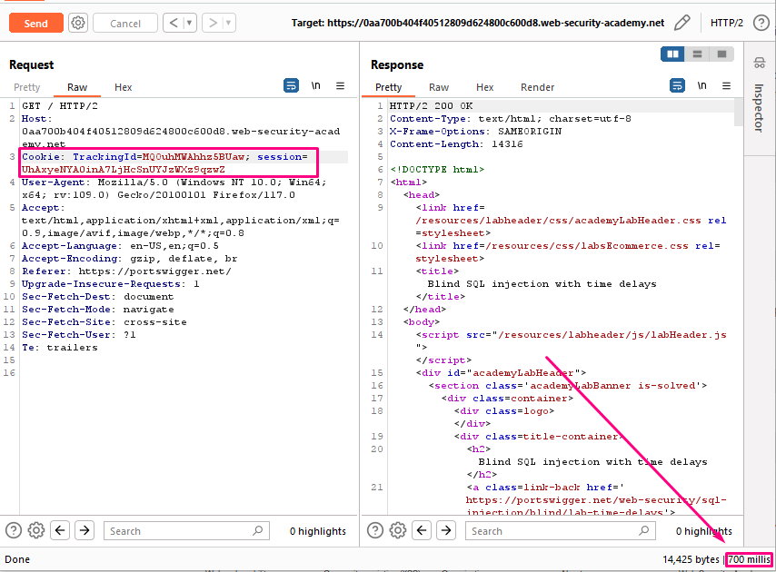
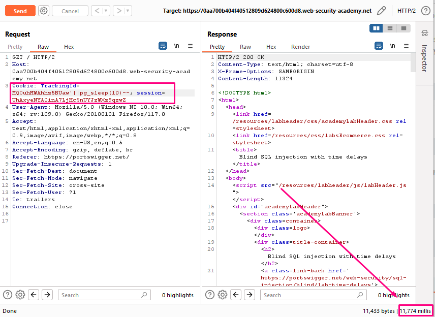

## Blind SQL injection with time delays

**Title:** Blind SQL injection with time delays. [Go](https://portswigger.net/web-security/sql-injection/blind/lab-time-delays)

**Description:** This lab contains a blind SQL injection vulnerability. The application uses a tracking cookie for analytics, and performs a SQL query containing the value of the submitted cookie. The results of the SQL query are not returned, and the application does not respond any differently based on whether the query returns any rows or causes an error. However, since the query is executed synchronously, it is possible to trigger conditional time delays to infer information.
To solve the lab, exploit the SQL injection vulnerability to cause a 10 second delay.

## Preface

If the application catches database errors when the SQL query is executed and handles them gracefully, there won't be any difference in the application's response. This means the previous technique for inducing conditional errors will not work. In this situation, it is often possible to exploit the blind SQL injection vulnerability by triggering time delays depending on whether an injected condition is true or false. As SQL queries are normally processed synchronously by the application, delaying the execution of a SQL query also delays the HTTP response. This allows you to determine the truth of the injected condition based on the time taken to receive the HTTP response.
The techniques for triggering a time delay are specific to the type of database being used. For example, on Microsoft SQL Server, you can use the following to test a condition and trigger a delay depending on whether the expression is true:

`'; IF (1=2) WAITFOR DELAY '0:0:10'--`
`'; IF (1=1) WAITFOR DELAY '0:0:10'--`

The first of these inputs does not trigger a delay, because the condition `1=2` is false. The second input triggers a delay of 10 seconds, because the condition `1=1` is true. Using this technique, we can retrieve data by testing one character at a time:
`'; IF (SELECT COUNT(Username) FROM Users WHERE Username = 'Administrator' AND SUBSTRING(Password, 1, 1) > 'm') = 1 WAITFOR DELAY '0:0:{delay}'--`

## Methodology

### Finding the vulnerable parameter
Initially, our foremost objective is to identify a potential vulnerability within the application's parameters that allows for the execution of SQL queries. In the context of this shopping application, we are particularly interested in the `TrackingId` cookie parameter , where the backend logic is designed to query the submitted data.

### My thought

At first we have to determine which database is using the application. For this we have to use all these payload:
Database | Payload
-------- | -----
Oracle | dbms_pipe.receive_message(('a'),10)
Microsoft | WAITFOR DELAY '0:0:10'
PostgreSQL | SELECT pg_sleep(10)
MySQL	| SELECT SLEEP(10)

We tried all these payloads & figured out that this web application is using PostgreSQL. Our payload is `TrackingId=MQOuhMWAhhz5BUaw'||pg_sleep(10)--`.

