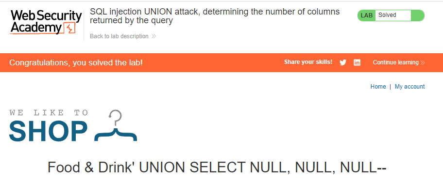

## SQL injection UNION attack, determining the number of columns returned by the query
**Title:** SQL injection UNION attack, determining the number of columns returned by the query. [GO](https://portswigger.net/web-security/sql-injection/union-attacks/lab-determine-number-of-columns)

**Description:** This lab contains a SQL injection vulnerability in the product category filter. The results from the query are returned in the application's response, so you can use a UNION attack to retrieve data from other tables. The first step of such an attack is to determine the number of columns that are being returned by the query. You will then use this technique in subsequent labs to construct the full attack. To solve the lab, determine the number of columns returned by the query by performing a SQL injection UNION attack that returns an additional row containing null values.

## Preface
When an application is vulnerable to SQL injection and the results of the query are returned within the application's responses, the `UNION` keyword can be used to retrieve data from other tables within the database. The  `UNION`  keyword lets you execute one or more additional  `SELECT`  queries and append the results to the original query. For example:
```sql
SELECT a, b FROM table1 UNION SELECT c, d FROM table2
```
For a  `UNION`  query to work, two key requirements must be met:

_The individual queries must return the same number of columns._
 
_The data types in each column must be compatible between the individual queries._

## Methodology

### Finding the vulnerable parameter
Initially, our foremost objective is to identify a potential vulnerability within the application's parameters that allows for the execution of SQL queries. Notably, in the context of this shopping application, we are particularly interested in the product category functionality, where the backend logic is designed to query the submitted data.
_https://lb_id.web-security-academy.net/filter?category=Food&Drink_
### My thought
For `UNION` attack to be happened  individual queries must return the same number of columns & that's the task for this lab. 
We have the option of pursuing this task through two distinct methods. The first method involves injecting a series of `ORDER BY` clauses and incrementing the specified column index until an error occurs.
```sql
' ORDER BY 1--
' ORDER BY 2-- 
' ORDER BY 3--
```
When the specified column index exceeds the number of actual columns in the result set, the database returns an error, such as:
`The ORDER BY position number 3 is out of range of the number of items in the select list.`

The second method involves submitting a series of  `UNION SELECT`  payloads specifying a different number of null values:
```sql
' UNION SELECT NULL-- 
' UNION SELECT NULL,NULL--
' UNION SELECT NULL,NULL,NULL--
```
If the number of nulls does not match the number of columns, the database returns an error, such as:

`All queries combined using a UNION, INTERSECT or EXCEPT operator must have an equal number of expressions in their target lists.`

The reason for using  `NULL`  as the values returned from the injected  `SELECT`  query is that the data types in each column must be compatible between the original and the injected queries. Since  `NULL`  is convertible to every commonly used data type, using  `NULL`  maximizes the chance that the payload will succeed when the column count is correct.

### Payload
We will systematically attempt the `' UNION SELECT NULL--` technique until we obtain the desired outcome in the application's response.



After executing the query parameter with `' UNION SELECT NULL, NULL, NULL--`, the backend successfully processes the query without generating any errors. From this observation, we deduce that the database comprises three columns.

**Understanding the Logic:**
```sql
' ORDER BY 1--
' ORDER BY 2-- 
' ORDER BY 3--
```
This series of payloads modifies the original query to order the results by different columns in the result set. The column in an ORDER BY clause can be specified by its index, so you don't need to know the names of any columns. When the specified column index exceeds the number of actual columns in the result set, the database returns an error, such as:

`The ORDER BY position number 3 is out of range of the number of items in the select list.`

 **Note:**
Notice that in the process of solving the lab we didn’t confirm where the vulnerability exists or not. As from the lab description we know the _product category filter_ parameter is vulnerable to SQL injection. We did not do any confirmation test or something like that. But in a real world scenario you have to first confirm the vulnerability then go for further exploitation.
