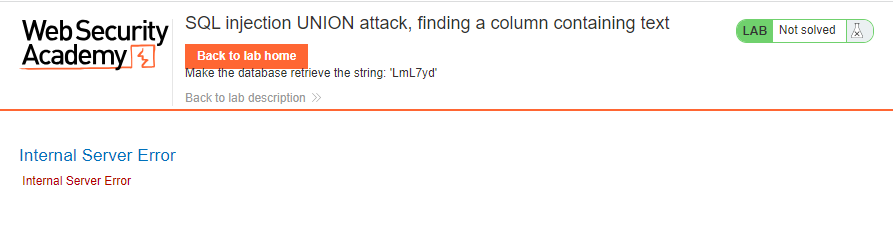
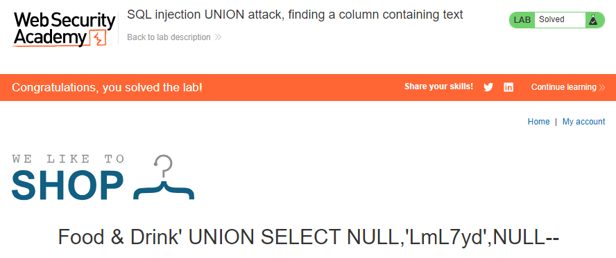

## SQL injection UNION attack, finding a column containing text
**Title:** SQL injection UNION attack, finding a column containing text. [GO](https://portswigger.net/web-security/sql-injection/union-attacks/lab-find-column-containing-text)

**Description:** This lab contains a SQL injection vulnerability in the product category filter. The results from the query are returned in the application's response, so you can use a UNION attack to retrieve data from other tables. To construct such an attack, you first need to determine the number of columns returned by the query. You can do this using a technique you learned in a previous lab. The next step is to identify a column that is compatible with string data.

The lab will provide a random value that you need to make appear within the query results. To solve the lab, perform a SQL injection UNION attack that returns an additional row containing the value provided. This technique helps you determine which columns are compatible with string data.

## Preface

The reason for performing a SQL injection UNION attack is to be able to retrieve the results from an injected query. Generally, the interesting data that you want to retrieve will be in string form, so you need to find one or more columns in the original query results whose data type is, or is compatible with, string data.

Having already determined the number of required columns, you can probe each column to test whether it can hold string data by submitting a series of UNION SELECT payloads that place a string value into each column in turn. For example, if the query returns four columns, you would submit:
```sql
' UNION SELECT 'a',NULL,NULL,NULL--
' UNION SELECT NULL,'a',NULL,NULL--
' UNION SELECT NULL,NULL,'a',NULL--
' UNION SELECT NULL,NULL,NULL,'a'--
```
If the data type of a column is not compatible with string data, the injected query will cause a database error, such as:

Conversion failed when converting the varchar value `'a'` to data type int.
If an error does not occur, and the application's response contains some additional content including the injected string value, then the relevant column is suitable for retrieving string data.

## Methodology

### Finding the vulnerable parameter
Initially, our foremost objective is to identify a potential vulnerability within the application's parameters that allows for the execution of SQL queries. Notably, in the context of this shopping application, we are particularly interested in the product category functionality, where the backend logic is designed to query the submitted data.
_https://lb_id.web-security-academy.net/filter?category=Food&Drink_
### My thought
At first we have to determine the number of column exists in database table. Then we go for finding a column containing text. Solving the previous lab we used `' UNION SELECT NULL, NULL, NULL --` payload. But in this lab we will use `ORDER BY` clauses and incrementing the specified column index until an error occurs.
### Payload
After invoking `' ORDER BY 4--` application shows `Internal Server Error` That's the indication of the application has _3_ columns.


Now we have to find for the specified column for expected data type. And the payload will be
```sql
' UNION SELECT 'a',NULL,NULL--
' UNION SELECT NULL,'a',NULL--
' UNION SELECT NULL,NULL,'a'--
```

And we got our result by submitting `' UNION SELECT NULL,'a',NULL--` in the url.




**Understanding the Logic:**
```sql
' UNION SELECT NULL, NULL,NULL--
```
Since `NULL` is convertible to every commonly used data type, using `NULL` maximizes the chance that the payload will succeed when the column count is correct.
```sql
' UNION SELECT 'a',NULL, NULL--
' UNION SELECT NULL, 'a', NULL--
' UNION SELECT NULL, NULL, 'a'
```
If the data type of a column is not compatible with string data, the injected query will cause a database error, such as: `Conversion failed when converting the varchar value 'a' to data type int.`

 **Note:** Notice that in the process of solving the lab we didn’t confirm where the vulnerability exists or not. As from the lab description we know the _product category filter_ parameter is vulnerable to SQL injection. We did not do any confirmation test or something like that. But in a real world scenario you have to first confirm the vulnerability then go for further exploitation.

