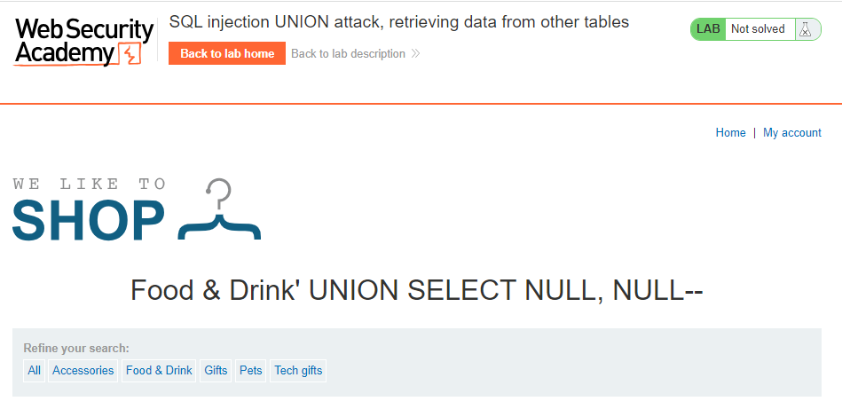
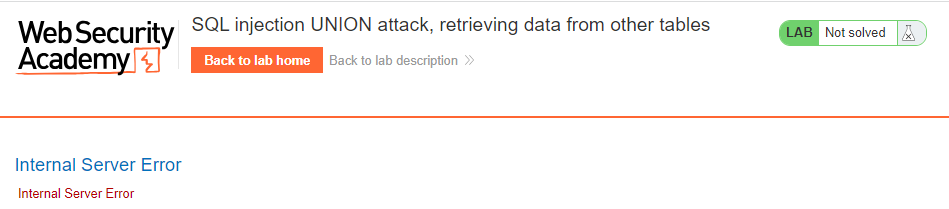
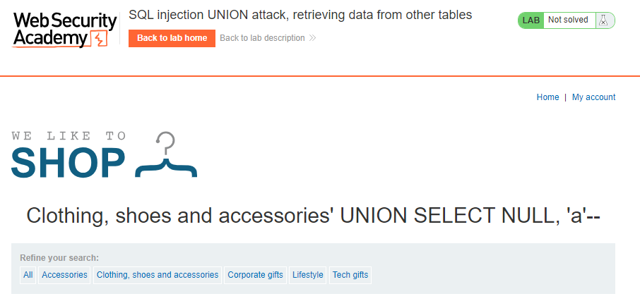
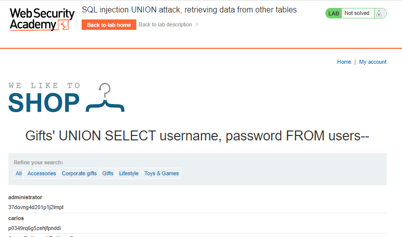

# SQL injection UNION attack, retrieving data from other tables
**Title:** SQL injection UNION attack, retrieving data from other tables [Go](https://portswigger.net/web-security/sql-injection/union-attacks/lab-retrieve-data-from-other-tables)

**Description:** This lab contains a SQL injection vulnerability in the product category filter. The results from the query are returned in the application's response, so you can use a UNION attack to retrieve data from other tables. To construct such an attack, you need to combine some of the techniques you learned in previous labs. The database contains a different table called users, with columns called username and password. To solve the lab, perform a SQL injection UNION attack that retrieves all usernames and passwords, and use the information to log in as the administrator user.
The lab will provide a random value that you need to make appear within the query results. To solve the lab, perform a SQL injection UNION attack that returns an additional row containing the value provided. This technique helps you determine which columns are compatible with string data.

## Preface
When you have determined the number of columns returned by the original query and found which columns can hold string data, you are in a position to retrieve interesting data.

Suppose that:

_The original query returns two columns, both of which can hold string data._
_The injection point is a quoted string within the WHERE clause._
_The database contains a table called users with the columns username and password._

In this situation, you can retrieve the contents of the users table by submitting the input:
```sql
' UNION SELECT username, password FROM users--
```
Of course, the crucial information needed to perform this attack is that there is a table called users with two columns called username and password. Without this information, you would be left trying to guess the names of tables and columns. In fact, all modern databases provide ways of examining the database structure, to determine what tables and columns it contains.
## Methodology

### Finding the vulnerable parameter
Initially, our foremost objective is to identify a potential vulnerability within the application's parameters that allows for the execution of SQL queries. Notably, in the context of this shopping application, we are particularly interested in the product category functionality, where the backend logic is designed to query the submitted data.
_https://lb_id.web-security-academy.net/filter?category=Food&Drink_
### My thought
At first we have to __determine the number of column exists in database table.__ For solving this lab we will use ` 'UNION SELECT NULL--` technique. After trying  ` ' UNION SELECT NULL, NULL-- ` we got no error.

But after trying `' UNION SELECT NULL, NULL, NULL--` we got `Internal Server Error` 

And we conclude this database has two columns in this database table.

Now __we have to find columns with a useful data type.__ The reason for performing a SQL injection UNION attack is to be able to retrieve the results from an injected query. Generally, the interesting data that you want to retrieve will be in string form, so you need to find one or more columns in the original query results whose data type is, or is compatible with, string data.
After Trying `' UNION SELECT 'a', NULL--` & `' UNION SELECT NULL, 'a'--` we got the same result.

And it has been determined that both columns within the dataset are indeed of string data type.

### Payload
```sql
' UNION SELECT username, password FROM users--
```
& Result is


**Understanding the Logic:**
```sql
' UNION SELECT NULL, NULL--
```
Since `NULL` is convertible to every commonly used data type, using `NULL` maximizes the chance that the payload will succeed when the column count is correct.
```sql
' UNION SELECT 'a', NULL--
' UNION SELECT NULL, 'a'--
```
If the data type of a column is not compatible with string data, the injected query will cause a database error, such as: `Conversion failed when converting the varchar value 'a' to data type int.`

 **Note:** Notice that in the process of solving the lab we didn’t confirm where the vulnerability exists or not. As from the lab description we know the _product category filter_ parameter is vulnerable to SQL injection. We did not do any confirmation test or something like that. But in a real world scenario you have to first confirm the vulnerability then go for further exploitation.

