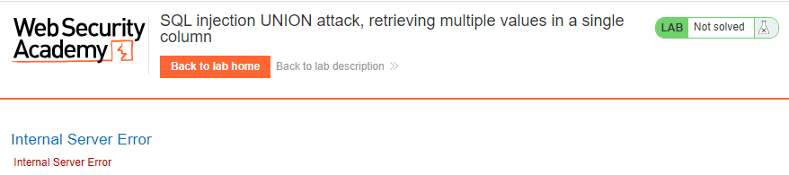
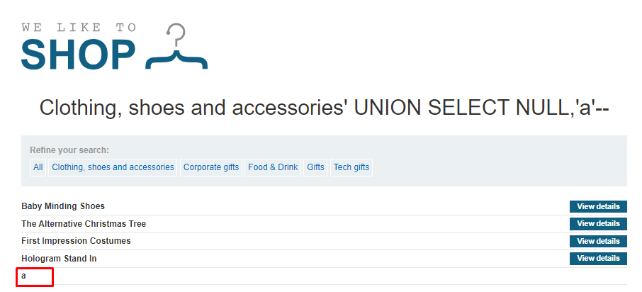
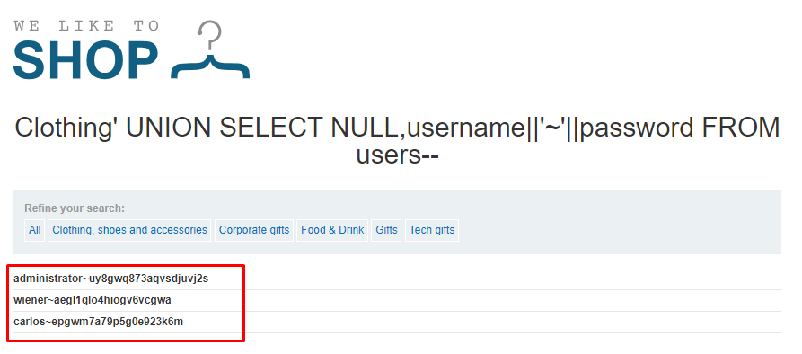

# SQL injection UNION attack, retrieving multiple values in a single column
**Title:** SQL injection UNION attack, retrieving multiple values in a single column. [Go](https://portswigger.net/web-security/sql-injection/union-attacks/lab-retrieve-multiple-values-in-single-column)

**Description:** 
This lab contains a SQL injection vulnerability in the product category filter. The results from the query are returned in the application's response so you can use a UNION attack to retrieve data from other tables.

The database contains a different table called `users`, with columns called `username` and `password`.

To solve the lab, perform a SQL injection UNION attack that retrieves all usernames and passwords, and use the information to log in as the `administrator` user.

## Preface

In the preceding example, suppose instead that the query only returns a single column.

You can easily retrieve multiple values together within this single column by concatenating the values together, ideally including a suitable separator to let you distinguish the combined values. For example, on Oracle you could submit the input:

`' UNION SELECT username || '~' || password FROM users--`

This uses the double-pipe sequence `||` which is a string concatenation operator on Oracle. The injected query concatenates together the values of the `username` and `password` fields, separated by the `~` character.

The results from the query will let you read all of the usernames and passwords, for example:

```
...
administrator~s3cure
wiener~peter
carlos~montoya
...
```
Note that different databases use different syntax to perform string concatenation.

## Methodology

### Finding the vulnerable parameter
Initially, our foremost objective is to identify a potential vulnerability within the application's parameters that allows for the execution of SQL queries. Notably, in the context of this shopping application, we are particularly interested in the product category functionality, where the backend logic is designed to query the submitted data.

### My thought
As we all know for a  `UNION`  query to work, two key requirements must be met:

_The individual queries must return the same number of columns._
_The data types in each column must be compatible between the individual queries._

Determining __number of columns present in the database table.__ Here we will use `ORDER BY` clause. After invoking `' ORDER BY 3--` we got `Internal Server Error`. That means this database has two columns.



Finding __column with string datatype.__ After invoking `' UNION SELECT NULL,'a'--` we got no error. That means the second column is string datatype.




### Payload
By using `' UNION SELECT NULL,username||'~'||password FROM users--`
we got desired result in application's response.



**Understanding the Logic:**
This uses the double-pipe sequence `||` which is a string concatenation operator. The injected query concatenates together the values of the `username` and `password` fields, separated by the `~` character. From lab description we know that this database contains a table called `users`, with columns called `username` and `password`. In real world scenario we have to first enumerate the table names with their associated column names using `information_schema` in MYSQL or `ALL_TABLES` in Oracle database.

 **Note:** Notice that in the process of solving the lab we didn’t confirm where the vulnerability exists or not. As from the lab description we know the _product category filter_ parameter is vulnerable to SQL injection. We did not do any confirmation test or something like that. But in a real world scenario you have to first confirm the vulnerability then go for further exploitation.
