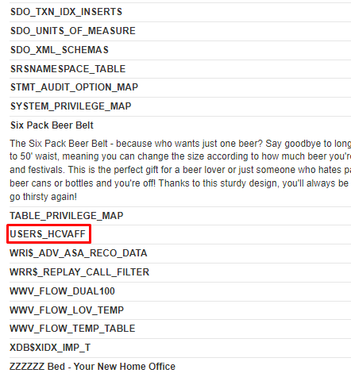

# SQL injection attack, listing the database contents on Oracle
**Title:** SQL injection attack, listing the database contents on Oracle. [Go](https://portswigger.net/web-security/sql-injection/examining-the-database/lab-listing-database-contents-oracle)

**Description:** 
This lab contains a SQL injection vulnerability in the product category filter. The results from the query are returned in the application's response so you can use a UNION attack to retrieve data from other tables.

The application has a login function, and the database contains a table that holds usernames and passwords. You need to determine the name of this table and the columns it contains, then retrieve the contents of the table to obtain the username and password of all users.

To solve the lab, log in as the `administrator` user.

## Preface

On Oracle, you can obtain the same information with slightly different queries. You can list tables by querying `all_tables`: `SELECT * FROM all_tables`. And you can list columns by querying `all_tab_columns`:
`SELECT * FROM all_tab_columns WHERE table_name = 'USERS'`

## Methodology

### Finding the vulnerable parameter
Initially, our foremost objective is to identify a potential vulnerability within the application's parameters that allows for the execution of SQL queries. Notably, in the context of this shopping application, we are particularly interested in the product category functionality, where the backend logic is designed to query the submitted data.

### My thought
As we all know for a  `UNION`  query to work, two key requirements must be met:

_The individual queries must return the same number of columns._
_The data types in each column must be compatible between the individual queries._
Determining __number of columns present in the database table.__ Here we will use `ORDER BY` clause. After invoking `' ORDER BY 3#` we got `Internal Server Error`. That means this database has two columns.

Finding _column with string datatype._ After invoking `' UNION SELECT 'a','a' FROM DUAL--` we got no error. Means both column is string datatype.

**Tip:** As you can see from this lab, there is _product name_ with their _description_ and both are string data type. This is a strong indication that the table has two columns & both of which are string data types.

### Payload
At first enumerate table name using `all_tables`. `' UNION SELECT table_name,NULL FROM all_tables--` helps us with this. 

 Now find out the number of columns in table `USERS_HCVAFF`. `' UNION SELECT column_name,NULL FROM all_tab_columns WHERE table_name='USERS_HCVAFF'--` helps us with this.
 

 And at last enumerate the content in these two columns. `' UNION SELECT USERNAME_UDFHCA, PASSWORD_VHAXCV FROM USERS_HCVAFF--` helps us with this.
 

**Understanding the Logic:**

1. Data Schema Analysis

Initiate the reconnaissance process by first determining the number of columns in the database and their respective data types. This critical step lays the foundation for further investigation.

2. Table Enumeration

Employ the `' UNION SELECT table_name,NULL FROM all_tables--` query to systematically retrieve a comprehensive list of all tables within the database. This meticulous process allows us to identify the specific table of interest, namely `USERS_HCVAFF`.

3. Column Enumeration

Once the target table `USERS_HCVAFF` has been identified, proceed to enumerate its column names. Utilize the query `' UNION SELECT column_name,NULL FROM all_tab_columns WHERE table_name='USERS_HCVAFF'--` to meticulously gather information about the structure of this table.

4. Data Extraction

Conclude the enumeration process by extracting the contents of the `USERS_HCVAFF` table. Employ the query `' UNION SELECT USERNAME_UDFHCA, PASSWORD_VHAXCV FROM USERS_HCVAFF--` to obtain the specific data of interest, including usernames and corresponding password hashes.

 **Note:** Notice that in the process of solving the lab we didn’t confirm where the vulnerability exists or not. As from the lab description we know the _product category filter_ parameter is vulnerable to SQL injection. We did not do any confirmation test or something like that. But in a real world scenario you have to first confirm the vulnerability then go for further exploitation.
