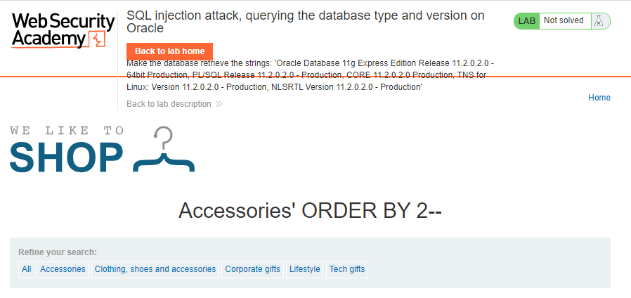
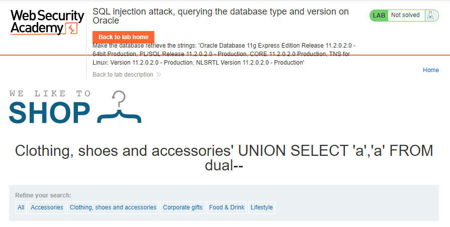
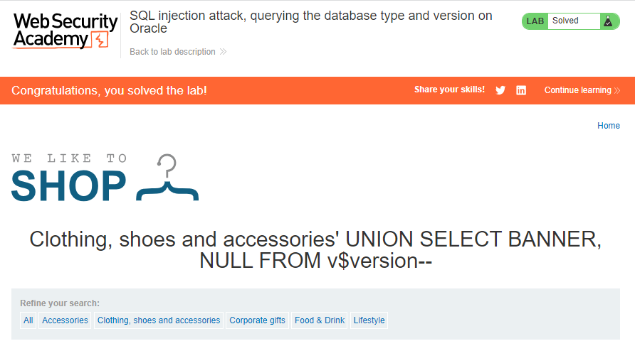

# SQL injection attack, querying the database type and version on Oracle
**Title:** SQL injection attack, querying the database type and version on Oracle. [Go](https://portswigger.net/web-security/sql-injection/examining-the-database/lab-querying-database-version-oracle)

**Description:** This lab contains a SQL injection vulnerability in the product category filter. You can use a UNION attack to retrieve the results from an injected query.
To solve the lab, display the database version string.

## Preface
When exploiting SQL injection vulnerabilities, it is often necessary to gather some information about the database itself. This includes the type and version of the database software, and the contents of the database in terms of which tables and columns it contains.
Different databases provide different ways of querying their version. You often need to try out different queries to find one that works, allowing you to determine both the type and version of the database software.

The queries to determine the database version for some popular database types are as follows:

Database type | Query
-------- | -----
Microsoft, MySQL | `SELECT @@version`
Oracle | `SELECT * FROM v$version`
PostgreSQL | `SELECT version()`

For example, you could use a  `UNION`  attack with the following input: `' UNION SELECT @@version--`

This might return output like the following, confirming that the database is Microsoft SQL Server, and the version that is being used:

`Microsoft SQL Server 2016 (SP2) (KB4052908) - 13.0.5026.0 (X64) Mar 18 2018 09:11:49 Copyright (c) Microsoft Corporation Standard Edition (64-bit) on Windows Server 2016 Standard 10.0 <X64> (Build 14393: ) (Hypervisor)`

## Methodology

### Finding the vulnerable parameter
Initially, our foremost objective is to identify a potential vulnerability within the application's parameters that allows for the execution of SQL queries. Notably, in the context of this shopping application, we are particularly interested in the product category functionality, where the backend logic is designed to query the submitted data.

### My thought
As we all know for a  `UNION`  query to work, two key requirements must be met:

_The individual queries must return the same number of columns._
_The data types in each column must be compatible between the individual queries._
Determining __number of columns present in the database table.__ Here we will use `ORDER BY` clause. After invoking `' ORDER BY 3--` we got `Internal Server Error`. That means this database has two columns.

Finding _column with string datatype._ After invoking `' UNION SELECT 'a','a' FROM dual--` we got no error. Means both column is string datatype.

### Payload
After invoking  `' UNION SELECT BANNER, NULL FROM v$version--` we saw from application's response that the application uses Oracle database.

_While exploiting in the wild we have to use all payload mentioned in the preface section to confirm the database type as we don't know which database is using the application._

**Understanding the Logic:**
 `' UNION SELECT 'a','a' FROM dual--` determination of column data types can depend on the specific database system you are using. This SQL query determines the column data types based on the provided string literals, treating them as varchar or string by default.

`' UNION SELECT BANNER, NULL FROM v$version--` combines a column named `BANNER` from the `v$version` table with a `NULL` value in the second column using the `UNION` operator. Oracle database version information contained in the `v$version` table.

 **Note:** Notice that in the process of solving the lab we didn’t confirm where the vulnerability exists or not. As from the lab description we know the _product category filter_ parameter is vulnerable to SQL injection. We did not do any confirmation test or something like that. But in a real world scenario you have to first confirm the vulnerability then go for further exploitation.
